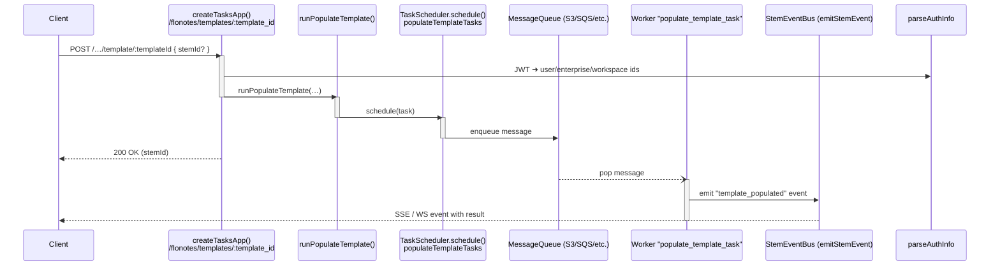

# Populate Template Task \(`populate_template_task` workflow\)

This document captures everything discussed in the design review / pairing session regarding the *Flonotes* template-population flow.

---

## 1. Public HTTP Endpoint

```
POST /tasks/flonotes/template/:template_id
```

| Parameter | Location | Type | Description |
|-----------|----------|------|-------------|
| `template_id` | path | `string` | The template slug to populate. |
| `stemId` | body | `string` *(optional)* | Existing stem to associate with the note. When omitted a new `stm_*` id is generated. |

The endpoint definition lives in
`platform/gateways/noggin/src/tasks/app.ts` (lines ≈ 200-235 at time of writing).
It simply validates the request with Zod and then calls the handler below.

## 2. Handler – `runPopulateTemplate()`

*File*: `platform/gateways/noggin/src/tasks/handlers/run-populate-template.ts`

High-level steps:

1. Generate a `traceId` and, if not supplied, a fresh `stemId` via `generateRandomId("stm")`.
2. **Schedule** a task on the `platform.populateTemplateTasks` queue:
   ```ts
   await platform.populateTemplateTasks.schedule({
     taskName: "populate_template_task",
     config: { workfloMeta, source_meta, workspaceConfig },
     clinicalsQuery: []
   });
   ```
3. Return the `stemId` to the API layer so the client gets an immediate *200 OK*.

(Events will be emitted later; TODOs in the file mark where they belong.)

## 3. Ant-URI Helpers (new)

| Function | Signature | Produces |
|----------|-----------|----------|
| `buildAntPath()` | `(workspaceId: string, ...segments: (string \| number \| undefined)[])` | Generic builder. |
| `getTemplateRefUrl()` | `(workspaceId, templateId)` | `ant://{workspace}/templates/{templateId}/{templateId}.template.md` |
| `getClinicalsRefUrl()` | `(workspaceId, stemId)` | `ant://{workspace}/clinicals/{stemId}` |

All three live in `platform/gateways/noggin/src/tasks/utils/artifacts/index.ts` so every consumer shares one source of truth.

```ts
export const getTemplateRefUrl = (w, t) =>
  buildAntPath(w, "templates", t, `${t}.template.md`);
```

## 4. Sequence Diagram (Mermaid)



## 5. Worker Responsibilities (outline)

The Florence / brrr worker listening for `workflow_name === "populate_template_task"` must:

1. Fetch the template markdown using `getTemplateRefUrl()`.
2. Fetch zero or more clinical artifacts (`getClinicalsRefUrl()`) when required.
3. Interpolate variables, render the markdown to the desired formats.
4. Store the resulting artifact (PDF/HTML) back in the artifact store.
5. Emit a `stem_event` (e.g. `template_populated_v1_0`) that references the new artifact ID.

## 6. Artefact-Store Path Convention

The helper follows the hierarchy below (see `tasks/utils/artifacts/index.ts`):

```
artifacts/{workspaceUid}/{category}/{sourceId}/{artifactId}.{ext}
```

Categories currently supported: `clinicals`, `determinations`, `config`, `criteria`, `tips`, `members`.

## 7. Future Enhancements

* Emit stem events for **start** and **fail** states (currently TODO).
* Allow multiple clinical Ant-URIs (`clinicalsQuery`) once the brrr task supports it.
* Consider making `ArtifactCategory`-specific helper functions generated from the same source of truth to avoid string duplication.

---

_Last updated: <!-- date will be whatever commit time is -->_
