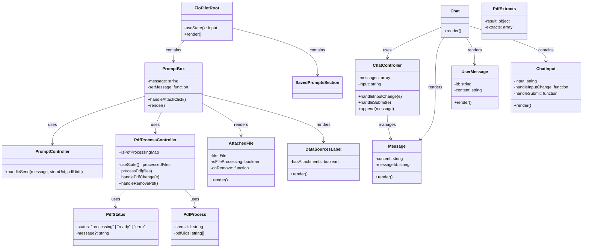
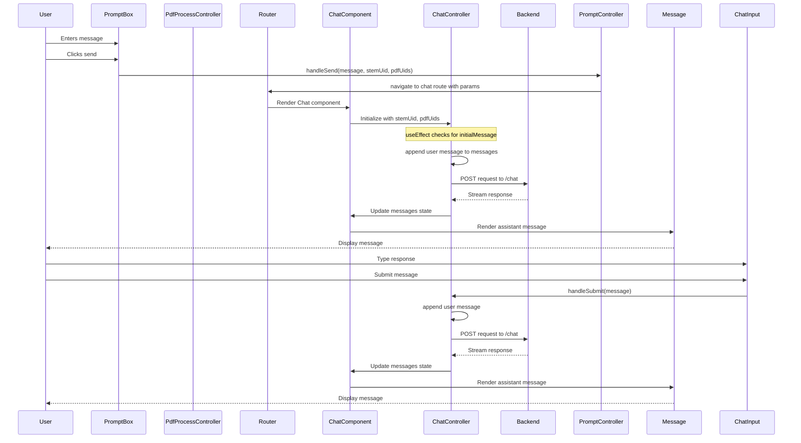
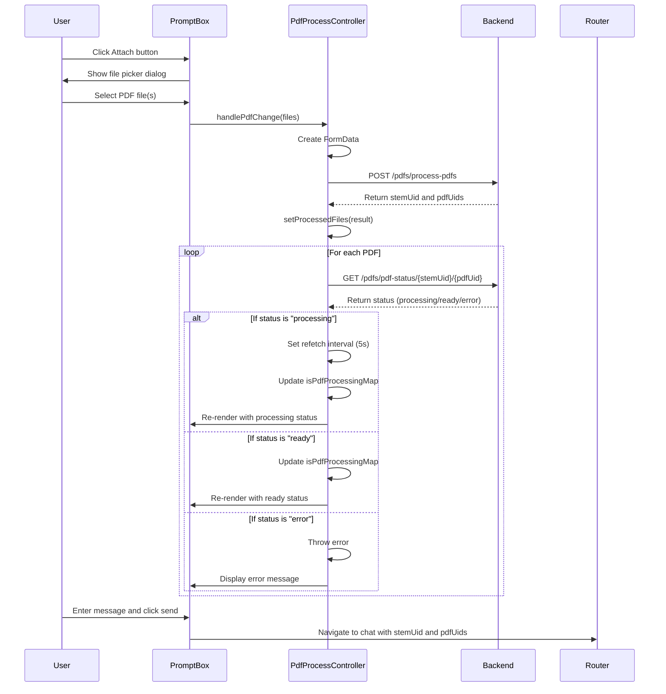

# Flopilot Chat and PDF Architecture

This document outlines the architecture and flow of Flopilot's chat functionality and PDF handling.

## Class Diagram

## Sequence Diagram: Chat Flow

## Sequence Diagram: PDF Upload and Processing Flow

## Key Technical Details

### PDF Processing Flow
- PDF files are uploaded via FormData to `/pdfs/process-pdfs` endpoint
- Backend assigns a unique stemUid and pdfUids for each uploaded file
- Frontend polls the PDF status endpoint to check processing progress
- Processing states are tracked in isPdfProcessingMap for UI feedback

### Chat Flow with PDFs
- When navigating to the chat route, stemUid and pdfUids are passed as URL parameters
- ChatController initializes with these parameters and includes them in API calls
- The backend uses the PDFs as context for the chat conversation
- User messages and AI responses use the same chat component structure

### Data Architecture
- Each chat session has a unique stemUid identifier
- PDF documents have unique pdfUids linked to the session stemUid
- Messages are streamed from the backend using AI SDK's useChat hook
- PDF processing status is polled at 5-second intervals until complete

### Technologies Used
- **TanStack Router** for routing
- **React Query** for server state management and API calls
- **AI SDK** for chat functionality
- **Zod** for schema validation

### Architectural Patterns
- **Model-View-Controller (MVC)** pattern
- Clear separation between UI components (view), business logic (controllers), and data models
- Reactive UI updates based on state changes
- Polling pattern for long-running processes
