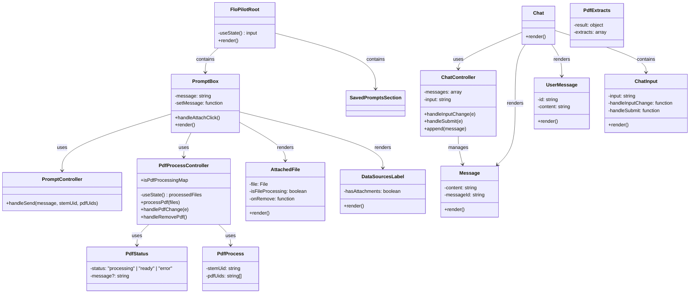
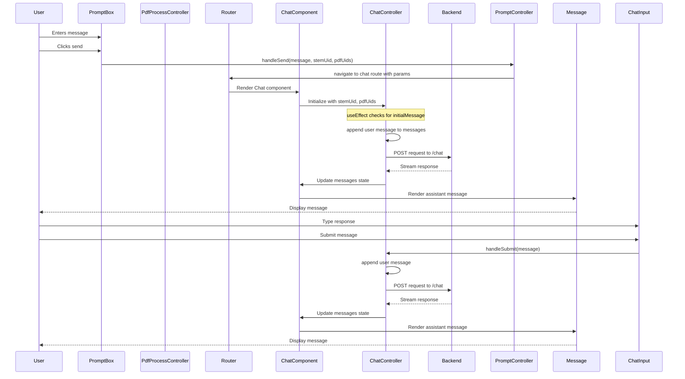
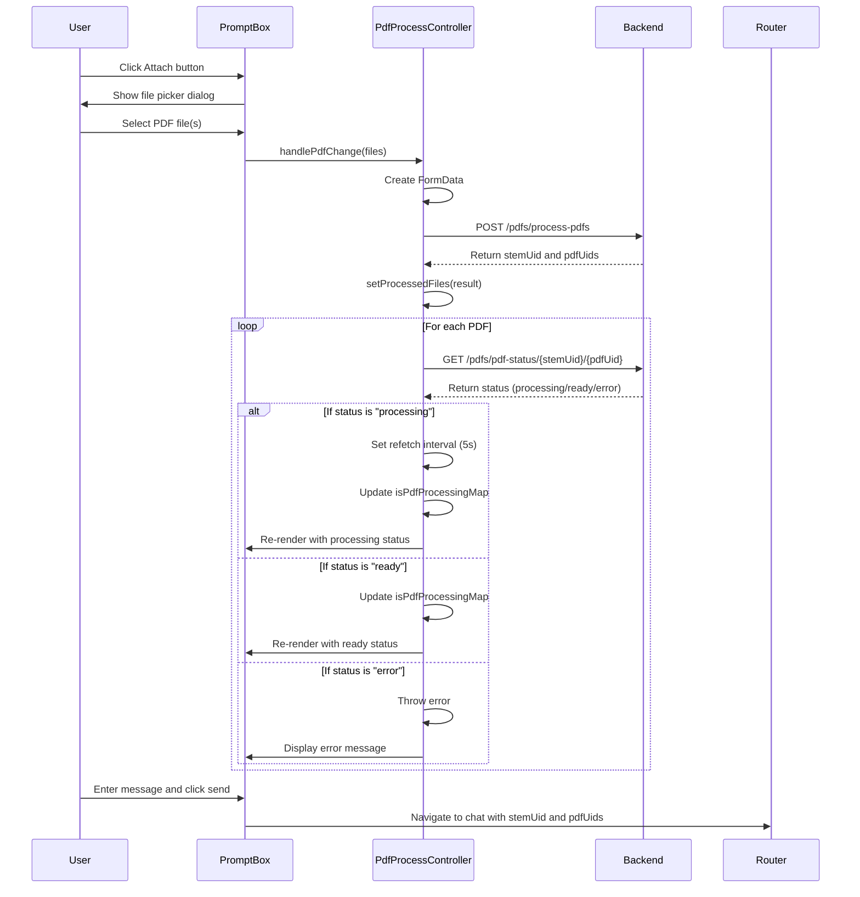

/Users/hank/dotfiles/AI/PDF.anterior.md /Users/hank/dotfiles/AI/PRD-2.md /Users/hank/dotfiles/AI/PRD.md /Users/hank/dotfiles/AI/PDF_CHAT.md /Users/hank/dotfiles/AI/NOGGIN.md /Users/hank/dotfiles/AI/NIX-SETUP.md /Users/hank/dotfiles/AI/Frontend-Backend-Integration.anterior.md /Users/hank/dotfiles/AI/DEMO.md /Users/hank/dotfiles/AI/CONVENTIONAL_COMMITS.md /Users/hank/dotfiles/AI/CODEGEN.md /Users/hank/dotfiles/AI/AUTH.md /Users/hank/dotfiles/AI/BUILD.NODE.md /Users/hank/dotfiles/AI/CHAT.md /Users/hank/dotfiles/AI/CLAUDE_HISTORY.md /Users/hank/dotfiles/AI/CLAUDE.local.md /Users/hank/dotfiles/AI/CLAUDE.md

# Anterior PDF Processing Architecture

This document details the PDF processing architecture used in the Anterior platform, specifically the integration between the `platform` repository's Noggin gateway and the `vibes` repository's frontend applications.

## Overview

The PDF processing system in Anterior follows a microservices architecture with:

1. **Backend Services** (in `platform` repo) - Handle PDF storage, processing, and extraction
2. **Frontend Applications** (in `vibes` repo) - Provide user interfaces for PDF upload, viewing, and analysis
3. **API Gateway** (Noggin) - Serves as the communication layer between frontends and backend services

This architecture allows for a clean separation of concerns while enabling sophisticated PDF processing capabilities across multiple applications.

## System Components

### 1. Noggin Gateway (`platform/gateways/noggin`)

The Noggin gateway acts as the primary API endpoint for all PDF operations, implemented in `src/pdfs/app.ts`.

#### Key Endpoints

| Endpoint                         | Method | Purpose                  | Parameters/Body                       | Response                                                           |
| -------------------------------- | ------ | ------------------------ | ------------------------------------- | ------------------------------------------------------------------ |
| `/process-pdf`                   | POST   | Upload and process a PDF | `file` (PDF blob), optional `stemUid` | `{ stemUid: string, pdfUid: string }`                              |
| `/pdf-status/:stemUid/:pdfUid`   | GET    | Check processing status  | URL params: stemUid, pdfUid           | `{ status: "processing" \| "ready" \| "error", message?: string }` |
| `/pdf-extracts/:stemUid/:pdfUid` | GET    | Retrieve extracted data  | URL params: stemUid, pdfUid           | JSON structure of extracted content                                |

#### Authentication & Authorization

- Uses JWT-based authentication via HTTP-only cookies
- Extracts enterprise and user information from the JWT token
- Associates PDFs with specific enterprises for multi-tenant isolation

#### Implementation Details

1. **PDF Upload Process**:

   ```typescript
   // Creates a unique PDF ID and optionally a stem ID
   const pdfUid = generateRandomId("pdf");
   const stemUid = ctx.body.stemUid || generateRandomId("stm");

   // Stores the raw PDF in S3
   await ctx.platform.blobs.storeBlob(s3InputKey, blob, "application/pdf");

   // Schedules asynchronous processing
   await ctx.platform.flows.schedule(flowParams);
   ```

2. **Storage Structure**:

   - Raw PDFs: `stems/{enterpriseUid}/{stemUid}/{pdfUid}/raw.pdf`
   - Extracted data: `stems/{enterpriseUid}/{stemUid}/{pdfUid}/extracts.json`

3. **Error Handling**:
   - Maps common S3 errors to appropriate HTTP responses
   - Returns 404 for PDFs still processing or not found
   - Returns 500 for processing service failures

### 2. PDF Processing Flow

1. **Upload**: Frontend uploads PDF to Noggin
2. **Initial Storage**: Noggin stores raw PDF in S3
3. **Processing**: Noggin schedules an asynchronous workflow
4. **Extraction**: Workflow processes PDF and stores JSON extracts
5. **Status Check**: Frontend polls status endpoint until processing completes
6. **Retrieval**: Frontend fetches and displays extracted content

### 3. Vibes Apps Implementation

#### A. Flonotes App (`vibes/apps/flonotes`)

Flonotes provides advanced PDF viewing and annotation capabilities for clinical documentation.

**Key Components**:

1. **API Integration** (`src/services/noggin-api.ts`):

   - Complete client implementation for Noggin PDF endpoints
   - Handles authentication, error management, and retries
   - Implements status polling with exponential backoff

2. **PDF Processing** (`src/hooks/use-process-pdf.ts`):

   - Custom React hook that manages PDF processing state
   - Tracks upload progress, processing status, and results

3. **PDF Viewer** (`src/components/shell/pdf/`):

   - Rich PDF viewing UI with page navigation
   - Highlight and annotation capabilities
   - Citation linking between PDF content and notes

4. **IndexedDB Integration** (`src/indexed-db/db.ts`):
   - Local storage of PDF metadata and processing results
   - Enables offline viewing of previously processed PDFs

**Sample API Usage**:

```typescript
// Process a PDF and retrieve extractions
const extractsResponse = await processAndGetPdfExtracts(
  fileData, // PDF binary data as number[]
  fileName, // Original filename
  "clinical", // Document type (clinical or criteria)
  undefined, // Optional stemUid
  100, // Max polling retries
  5000, // Polling interval (ms)
);
```

#### B. Flopilot App (`vibes/apps/flopilot`)

Flopilot uses PDFs as context for AI-assisted interactions and chat functionality.

**Key Components**:

1. **Controller Pattern** (`src/controller/use-pdf-process-controller.ts`):

   - State management for PDF processing
   - Integration with chat context

2. **PDF Models** (`src/controller/models/`):

   - `pdf-extracts.ts` - Types for extracted PDF content
   - `pdf-status.ts` - Status response handling
   - `process-pdf.ts` - PDF upload request models

3. **Chat Integration**:

   - Uses processed PDFs as context for AI-assisted chats

   - Links relevant PDF content to chat messages

## Technical Details

### 1. Stem Concept

A "stem" (`stemUid`) represents a logical grouping of related documents:

- Multiple PDFs can share the same `stemUid`
- Enables contextual relationships between documents
- Used for organizing documents in a case or workflow

### 2. Processing Pipeline

1. **PDF Upload**:

   - Multipart form data upload with optional metadata
   - Returns immediately with tracking IDs before processing completes

2. **Asynchronous Processing**:

   - Uses workflow engine for reliable, scalable processing
   - Extracts text, structure, and semantic information
   - Produces standardized JSON output

3. **Status Checking**:

   - Simple polling mechanism for checking completion
   - Returns processing, ready, or error states
   - Includes error details when processing fails

4. **Extract Retrieval**:
   - Fetches JSON representation of processed PDF
   - Structure includes text blocks, page information, and metadata
   - May include domain-specific extractions (clinical findings, etc.)

### 3. JSON Extract Structure

```json
{
  "result": {
    "metadata": {
      "title": "Document Title",
      "author": "Author Name",
      "pages": 5,
      "creationDate": "2023-01-15T12:00:00Z"
    },
    "pages": [
      {
        "pageNumber": 1,
        "blocks": [
          {
            "id": "block-1",
            "text": "Example text content",
            "boundingBox": {
              "x1": 100,
              "y1": 100,
              "x2": 400,
              "y2": 150
            },
            "type": "paragraph"
          }
          // More blocks...
        ]
      }
      // More pages...
    ],
    "structure": {
      // Document structure information
    }
  }
}
```

## Integration Instructions

To integrate PDF processing in a new vibes app:

### 1. Setup API Client

Create a service file that interfaces with Noggin PDF endpoints:

```typescript
// Example minimal API client
export async function processPdf(
  fileData: number[],
  fileName: string,
): Promise<{ stemUid: string; pdfUid: string }> {
  const formData = new FormData();
  formData.append("file", new Blob([new Uint8Array(fileData)]), fileName);

  const response = await fetch(`${NOGGIN_HOST}/pdfs/process-pdf`, {
    method: "POST",
    body: formData,
    credentials: "include", // For auth cookies
  });

  if (!response.ok) {
    throw new Error(`PDF processing failed: ${response.status}`);
  }

  return await response.json();
}
```

### 2. Implement Status Polling

```typescript
export async function waitForProcessing(
  stemUid: string,
  pdfUid: string,
  maxRetries = 100,
): Promise<void> {
  for (let attempt = 0; attempt < maxRetries; attempt++) {
    const response = await fetch(
      `${NOGGIN_HOST}/pdfs/pdf-status/${stemUid}/${pdfUid}`,
      {
        credentials: "include",
      },
    );

    if (!response.ok) {
      throw new Error(`Status check failed: ${response.status}`);
    }

    const status = await response.json();

    if (status.status === "ready") {
      return;
    }

    if (status.status === "error") {
      throw new Error(`Processing error: ${status.message}`);
    }

    // Wait before next check (with exponential backoff)
    await new Promise((resolve) =>
      setTimeout(resolve, Math.min(5000 * Math.pow(1.5, attempt), 30000)),
    );
  }

  throw new Error("Processing timed out");
}
```

### 3. Fetch Extractions

```typescript
export async function getExtractions(
  stemUid: string,
  pdfUid: string,
): Promise<any> {
  const response = await fetch(
    `${NOGGIN_HOST}/pdfs/pdf-extracts/${stemUid}/${pdfUid}`,
    {
      credentials: "include",
    },
  );

  if (!response.ok) {
    throw new Error(`Failed to get extractions: ${response.status}`);
  }

  return await response.json();
}
```

### 4. Complete Flow Example

```typescript
export async function processAndGetExtractions(file: File): Promise<any> {
  // Read file as array buffer
  const arrayBuffer = await file.arrayBuffer();
  const fileData = Array.from(new Uint8Array(arrayBuffer));

  // Upload and start processing
  const { stemUid, pdfUid } = await processPdf(fileData, file.name);

  // Wait for processing to complete
  await waitForProcessing(stemUid, pdfUid);

  // Get and return extractions
  return await getExtractions(stemUid, pdfUid);
}
```

## Deployment and Development Workflow

1. **Local Development**:

   - Start platform services: `nix develop` and `ant-all-services`
   - Build and deploy vibes app: `cd apps/your-app && npm i && ./deploy-local.sh`
   - Access via Noggin: `http://localhost:20701/your-app`

2. **Production Deployment**:
   - Vibes apps are built and uploaded to S3
   - Noggin serves them as static assets
   - API calls are proxied through Noggin to backend services

## Security Considerations

1. **Authentication**:

   - JWT tokens stored in HTTP-only cookies
   - Enterprise-specific isolation of PDFs
   - Role-based access controls for specific operations

2. **Data Protection**:

   - PDFs are stored in enterprise-specific S3 paths
   - All API calls require valid authentication
   - Processing results are isolated by enterprise

3. **Error Handling**:
   - User-friendly error messages
   - Detailed logging for debugging
   - Appropriate HTTP status codes

## Extending the System

To extend PDF processing capabilities:

1. **New Extraction Types**:

   - Add new processing flows in platform workflows
   - Extend the JSON schema for new data types
   - Update frontend components to display new data

2. **Additional Endpoints**:

   - Add new routes in Noggin's PDF app
   - Implement corresponding API clients in vibes apps

3. **Enhanced Visualization**:
   - Build new UI components for specialized PDF rendering
   - Implement domain-specific interactions (e.g., clinical annotations)

## Troubleshooting

### Common Issues

1. **PDF Upload Fails**:

   - Check authentication status (JWT token)
   - Verify file size within limits
   - Ensure file is valid PDF format

2. **Processing Never Completes**:

   - Check workflow service logs for errors
   - Verify S3 permissions are correct
   - Check for resource constraints in processing service

3. **Extract Retrieval Fails**:
   - Confirm processing has completed successfully
   - Verify S3 path is correct for the enterprise
   - Check for malformed JSON in extract file

### Debugging Tools

1. **API Request Logs**:

   - Check Noggin server logs for API request details
   - Look for HTTP status codes and error messages

2. **Storage Inspection**:

   - Use S3 tools to inspect raw PDFs and extracts
   - Verify file integrity and permissions

3. **Processing Status**:
   - Monitor workflow execution status
   - Check for failed or stalled workflows# Product Requirements Document

This document captures the requirements, preferences, and design principles for the dotfiles repository as expressed by the user in conversations.

## Core Requirements

### 1. Repository Structure

- **Modular Organization**: Configuration files must be organized in a modular structure by tool
- **Consistent Naming**: Directory names should match tool identifiers used throughout the repository
- **XDG Compliance**: Follow XDG Base Directory specification for all configurations
- **Documentation**: Each tool must have its own README with usage instructions

### 2. Installation and Setup

- **Idempotent Setup**: Setup script must be runnable multiple times without causing issues
- **Backup Mechanism**: Automatically back up existing configurations before overwriting
- **Minimal Dependencies**: Keep external dependencies to a minimum
- **Consistent Symlinking**: Use symlinks consistently (entire directories when possible)
- **Cross-platform Support**: Primary focus on macOS (Apple Silicon), but avoid architecture-specific code when possible

### 3. Tool Integration

- **Unified Task Runner**: Use Just to provide a consistent interface for commands
- **Fuzzy Finding**: Enable fuzzy search capabilities for commands
- **Hierarchical Commands**: Commands should be organized by tool and accessible via prefix
- **Shell Integration**: Integrate with ZSH for immediate access to commands

### 4. Visual and UX Preferences

- **Tokyo Night Theme**: Consistent Tokyo Night theme across all tools
- **Modern Terminal**: GPU-accelerated terminal with Ghostty
- **Vim-style Navigation**: Vim-inspired navigation in all supporting tools
- **Clean Interface**: Minimize visual clutter in terminal and UI
- **Performance Optimization**: Configure for Apple Silicon performance

### 5. Tool-Specific Requirements

#### Neovim

- LazyVim-based configuration
- LSP integration
- Consistent syntax highlighting
- Fuzzy file navigation
- Git integration

#### ZSH

- Fast startup times
- Comprehensive aliases
- Useful functions for navigation and productivity
- Integration with modern tools (Atuin, Zoxide, Starship)

#### Yazi

- Optimized for Apple Silicon
- Integration with Neovim
- Rich file previews
- Custom navigation shortcuts

#### Aerospace

- Vim-style window navigation
- Multiple workspace support
- Tokyo Night-inspired window gaps
- Modal key binding system

#### Starship

- Tokyo Night theme
- Right-side time and battery information
- Fast performance
- Informative but not cluttered

### 6. Documentation Standards

- **Consistent Format**: All documentation should follow a consistent format
- **Code Examples**: Include useful code examples for common operations
- **Installation Instructions**: Clear installation instructions for each tool
- **Customization Guide**: Document how to customize each configuration
- **Version Information**: Track versions of all tools

### 7. Version Control

- **Clean Commits**: Commits should have clear, descriptive messages
- **Atomic Changes**: Each commit should represent a single logical change
- **Version Tracking**: Maintain a VERSION.md file with current environment snapshot

## Design Principles

1. **Minimalism**: Keep configurations simple and focused
2. **Performance**: Optimize for speed and responsiveness
3. **Consistency**: Maintain consistent style and behaviors across tools
4. **Modularity**: Enable easy addition/removal of specific configurations
5. **Discoverability**: Make features and commands easy to discover
6. **Documentation**: Document everything thoroughly
7. **Maintainability**: Code should be clean and well-organized

## Constraints

1. **macOS-focused**: Primary platform is macOS on Apple Silicon
2. **ZSH-centric**: Shell configuration is centered around ZSH
3. **Modern tools**: Focus on modern, actively maintained tools
4. **Performance**: Must maintain fast shell startup times
5. **Backwards compatibility**: Support for older versions is not a priority

## Future Enhancements

1. **Additional Tool Integration**: Support for more development tools
2. **Automation**: Further automate setup and maintenance tasks
3. **Enhanced Documentation**: More comprehensive guides and examples
4. **Cross-platform**: Better support for Linux and other platforms
5. **Testing**: Add automated testing for configurations# AI Integration PRD

## Overview

This Product Requirements Document (PRD) defines the specifications for the AI integration system within the dotfiles repository. This system provides consistent, reusable components for leveraging Large Language Models (LLMs) in development workflows, following industry best practices as of May 2025.

## Goals

- Create a modular, composable AI tooling system
- Provide consistent interfaces across different LLM providers
- Optimize prompt design for efficiency and effectiveness
- Support multiple development workflows (coding, docs, testing)
- Enable programmatic access via shell and TypeScript
- Follow industry best practices for LLM utilization
- Support secure handling of credentials and context
- Maintain backward compatibility with existing tools

## Non-Goals

- Replacing specialized AI tools with custom implementations
- Supporting every possible LLM provider
- Handling training or fine-tuning of models
- Building a complete UI for AI interactions

## System Components

### 1. Directory Structure

```
config/ai/
├── core/                 # Core components and shared utilities
│   ├── config.yaml       # Central configuration (models, endpoints, etc.)
│   ├── constants.sh      # Shared constants for shell scripts
│   ├── types.ts          # TypeScript type definitions
│   └── utils.{sh,ts}     # Shared utility functions
├── providers/            # Provider-specific implementations
│   ├── anthropic/        # Anthropic/Claude specific configuration
│   ├── openai/           # OpenAI specific configuration
│   └── local/            # Local model configurations (Ollama, etc.)
├── prompts/              # Reusable prompt components
│   ├── base/             # Base prompt templates
│   ├── coding/           # Code-related prompts
│   ├── testing/          # Test generation prompts
│   └── docs/             # Documentation prompts
├── tools/                # CLI tools and integrations
│   ├── git/              # Git integrations
│   ├── ide/              # IDE integrations
│   └── api/              # API development tools
├── interfaces/           # Interface definitions and clients
│   ├── cli/              # Command-line interfaces
│   ├── ts/               # TypeScript library
│   └── bash/             # Bash utilities
└── templates/            # Output templates
    ├── code/             # Code templates
    ├── docs/             # Documentation templates
    └── configs/          # Configuration templates
```

### 2. Core Features

#### 2.1 Provider-Agnostic Interface

- Consistent command interface across providers
- Abstraction layer for different APIs
- Automatic fallback mechanisms
- Environment-aware provider selection

#### 2.2 Prompt Engineering System

- Modular, composable prompt components
- Versioned prompt templates
- Context-aware prompt generation
- Runtime prompt optimization

#### 2.3 Development Workflows

- Code generation and completion
- Code review and improvement
- Test generation
- Documentation generation
- Commit message generation
- API design and implementation

#### 2.4 Tool Integrations

- Git hooks and commands
- IDE integration (VS Code, Neovim)
- API tools (OpenAPI, client generation)
- Shell enhancements

#### 2.5 Configuration Management

- Environment-aware configuration
- Secure credential handling
- Provider-specific settings
- User preference management

## Technical Requirements

### 1. API Standards

- All API calls must implement proper error handling
- Rate limit compliance and retry mechanisms
- Secure token handling (no hardcoded tokens)
- Streaming support where applicable
- Proper timeout handling

### 2. Prompt Engineering

- All prompts must follow the OpenAI cookbook guidelines
- Prompts should be modular and composable
- Prompt versions should be tracked
- Prompts should include clear instructions and constraints
- System prompts should be separate from user prompts

### 3. Code Architecture

- TypeScript library must use proper types
- Shell scripts must follow best practices (ShellCheck compliance)
- Functions should be focused and reusable
- Proper logging and error reporting

### 4. Testing

- Unit tests for TypeScript components
- Integration tests for end-to-end workflows
- Prompt regression testing system
- Performance benchmarking for optimization

### 5. Security

- No credentials in code repositories
- Secure environment variable handling
- Proper input validation
- Content filtering for generated outputs

## Implementation Phases

### Phase 1: Core Infrastructure

- Define directory structure and interfaces
- Implement provider abstraction layer
- Create basic prompt templates
- Set up configuration system

### Phase 2: Tool Integration

- Implement Git integration
- Create IDE plugins/tools
- Develop API development tools
- Build shell utilities

### Phase 3: Advanced Features

- Implement prompt optimization
- Add multi-provider orchestration
- Create advanced workflow tools
- Performance optimization

## Success Metrics

- Reduction in development time for common tasks
- Improved code quality through AI assistance
- Consistent experience across different providers
- Modularity and reusability of components
- Performance and reliability of AI integrations

## Appendix

### A. Example Workflows

#### A.1 Code Generation

```bash
$ just ai:code typescript "Create a React component that displays a list of items with pagination"
```

#### A.2 Commit Message Generation

```bash
$ just ai:commit-msg
```

#### A.3 API Client Generation

```bash
$ just api:generate-client path/to/spec.yaml output-dir
```

### B. Provider Support Matrix

| Provider  | Models                   | Features                 | Best For                 |
| --------- | ------------------------ | ------------------------ | ------------------------ |
| Anthropic | Claude 3 Opus/Sonnet/etc | Strong reasoning         | Complex coding tasks     |
| OpenAI    | GPT-4/3.5                | Tool use, function calls | RAG, tool integration    |
| Gemini    | Gemini Pro/Ultra         | Large context window     | Documentation, analysis  |
| Local     | Mixtral, Llama 3, etc.   | Privacy, offline         | Quick tasks, prototyping |

### C. Prompt Engineering Guidelines

1. **Clarity**: Be specific and clear in instructions
2. **Context**: Provide necessary context for the task
3. **Examples**: Include examples for complex tasks
4. **Constraints**: Specify output format and limitations
5. **Roles**: Define clear roles for the model
6. **Iterative**: Design prompts to be iteratively improved
7. **Modular**: Break complex prompts into reusable components# PDF Chat System: Authentication and Network Flow

This document explains the complete flow of authentication and networking between the frontend application and backend services for the PDF chat feature. It covers the authentication process, PDF processing, and chat interaction.

## 1. Architecture Overview

The PDF chat system consists of the following components:

- **Frontend UI**: React application at `/vibes/apps/flopilot/src/`
- **Backend Services**: Node.js services at `/platform/gateways/noggin/src/`
  - PDF Processing Service: `/platform/gateways/noggin/src/pdfs/`
  - Chat Service: `/platform/gateways/noggin/src/chat/`
- **Storage**: S3-compatible storage for PDFs and extracted data

## 2. Authentication Flow

### 2.1 Login Process

The system uses a JWT-based authentication system:

1. User logs in via the login form (`/login.html`)
2. The system creates a one-time password (OTP) and redirects to verification page
3. After OTP verification, the server issues two tokens:
   - `access_token`: Short-lived JWT containing user and enterprise information
   - `refresh_token`: Long-lived token for refreshing access

These tokens are stored as cookies:

```
Cookie: auth_indicator=true; access_token=eyJhbGciOiJIUzI1NiIsInR5cCI6IkpXVCJ9...; refresh_token=eyJhbGciOiJIUzI1NiIsInR5cCI6IkpXVCJ9...
```

### 2.2 JWT Structure

The access token contains critical enterprise information:

```json
{
  "entr": {
    "ent_VRfC5vl0Fw5w_dcEVM-1w": "ADMIN"
  },
  "wksp": {
    "wksp_PnCmyFGy9fHwWgIOx_k5h": "ent_VRfC5vl0Fw5w_dcEVM-1w",
    "wksp_vBE6Z0LimBSHaF0bRZ5l2": "ent_VRfC5vl0Fw5w_dcEVM-1w"
  },
  "iss": "https://co-helm.com",
  "sub": "usr_BYZnJljHgUz_y4CLsSmTU",
  "aud": ["access"],
  "exp": 1746662704,
  "nbf": 1746661804,
  "iat": 1746661804,
  "jti": "jwt_kOtkgt504p1WtEZJpA83w"
}
```

The `enterpriseUid` (`ent_VRfC5vl0Fw5w_dcEVM-1w`) is extracted from this token and is required for all authenticated operations.

### 2.3 Token Extraction

Backend services extract the enterprise information using the `parseEnterpriseUserFromJwt` function from `/platform/gateways/noggin/src/auth/jwt.ts`:

```typescript
export function parseEnterpriseUserFromJwt(ctx: BaseContext): TokenContext {
  if (!ctx.jwtPayload?.entr) {
    throw new HTTPException(401, { message: "Authentication required" });
  }

  // Get enterprise and user uids from the token.
  let enterpriseUid = undefined;
  let role = undefined;

  // Most tokens will have a single enterprise.
  if (Object.keys(ctx.jwtPayload.entr).length === 1) {
    enterpriseUid = Object.keys(ctx.jwtPayload.entr)[0] as string;
    role = ctx.jwtPayload.entr[enterpriseUid];
  } else {
    // Logic for multiple enterprises...
  }

  // ...

  return {
    enterpriseUid,
    role,
    workspaceUid,
    userUid: ctx.jwtPayload.sub,
  };
}
```

## 3. PDF Processing Flow

### 3.1 PDF Upload

The process begins when a user uploads PDFs through the UI in `prompt-box.tsx`:

```typescript
// From /vibes/apps/flopilot/src/view/prompt-box.tsx
const { processedFiles, onPdfChange, onRemovePdf, isPdfProcessingMap } =
  usePdfProcessController();
```

The `usePdfProcessController` hook handles the PDF upload:

```typescript
// From /vibes/apps/flopilot/src/controller/use-pdf-process-controller.ts
const { mutateAsync: processPdf } = useMutation({
  mutationKey: PDF_PROCESS_KEY,
  mutationFn: async (files: File[]) => {
    const formData = new FormData();
    files.forEach((file) => {
      formData.append("files[]", file);
    });

    const response = await fetch(
      `${env.VITE_NOGGIN_HOST}/process-pdfs`, // Note: No pdfs/ prefix
      {
        method: "POST",
        body: formData,
        credentials: "include", // Explicitly include credentials
      },
    );
    // ... process response
  },
});
```

This request includes the authentication cookies thanks to the `credentials: "include"` option:

```
"cookie": "auth_indicator=true; access_token=eyJhbGciOiJIUzI1NiIsInR5cCI6IkpXVCJ9...; refresh_token=eyJhbGciOiJIUzI1NiIsInR5cCI6IkpXVCJ9..."
```

### 3.2 Backend PDF Processing

The backend endpoint `/pdfs/process-pdfs` in `/platform/gateways/noggin/src/pdfs/app.ts` handles the request:

1. It extracts the `enterpriseUid` from the JWT using `parseEnterpriseUserFromJwt`
2. Generates a `stemUid` and `pdfUid` for each uploaded file
3. Stores each PDF in S3 using a path structure: `stems/{enterpriseUid}/{stemUid}/{pdfUid}/raw.pdf`
4. Schedules a background flow for processing the PDF
5. Returns the `stemUid` and `pdfUids` to the client

```typescript
// From /platform/gateways/noggin/src/pdfs/app.ts
app.endpoint({
  method: "POST",
  body: processStemPdfSchema,
  response: stemPdfUidResponseSchema,
  route: "/process-pdfs",
  async handler(ctx) {
    const { enterpriseUid } = parseEnterpriseUserFromJwt(ctx);
    // ... process PDFs and store in S3
    return {
      stemUid,
      pdfUids: results.map((result) => result.pdfUid),
    };
  },
});
```

### 3.3 PDF Status Polling

After upload, the frontend polls the status of PDF processing:

```typescript
// From /vibes/apps/flopilot/src/controller/use-pdf-process-controller.ts
const combinedQueries = useQueries({
  queries: (processedFiles ?? []).map(({ pdfUid, stemUid }) => ({
    queryKey: [PDF_PROCESS_STATUS_KEY, pdfUid],
    queryFn: async () => {
      const response = await fetch(
        `${env.VITE_NOGGIN_HOST}/pdf-status/${stemUid}/${pdfUid}`, // No pdfs/ prefix
        {
          method: "GET",
          credentials: "include", // Explicitly include credentials
        },
      );
      // ... process response
    },
    refetchInterval: (query) => {
      if (query.state.data?.status === "processing") {
        return 5_000; // Poll every 5 seconds while processing
      }
      return false;
    },
  })),
});
```

The backend status endpoint again extracts the `enterpriseUid` from the JWT and checks if the processed file exists in the proper S3 path.

## 4. Chat Interaction Flow

### 4.1 Chat Request

Once PDFs are processed, users can chat about them. The chat request is made through the `useChatController` hook:

```typescript
// From /vibes/apps/flopilot/src/controller/use-chat-controller.ts
// Custom fetcher function to ensure credentials are included
const customFetcher = async (url: string, options: RequestInit) => {
  return fetch(url, {
    ...options,
    credentials: "include", // This ensures cookies are sent with the request
  });
};

export function useChatController() {
  // ...
  const { messages, input, append, handleInputChange, handleSubmit, error } =
    useChat({
      api: `${env.VITE_NOGGIN_HOST}/`, // Direct to root endpoint, not /chat
      streamProtocol: "text",
      body: {
        stemUid,
        pdfUids,
      },
      fetcher: customFetcher, // Use our custom fetcher that includes credentials
      onError: (error) => {
        console.error("Chat error:", error);
      },
    });
  // ...
}
```

### 4.2 Authentication Issue and Solution

**The Critical Issue**:

The AI SDK's `useChat` hook doesn't include cookies by default, unlike direct fetch calls from the browser. This caused 401 Unauthorized errors in the chat endpoint.

The solution is to implement a custom fetcher that explicitly includes credentials:

```typescript
const customFetcher = async (url: string, options: RequestInit) => {
  return fetch(url, {
    ...options,
    credentials: "include", // This ensures cookies are sent with the request
  });
};
```

This custom fetcher needs to be applied to all API requests to ensure authentication cookies are properly sent:

```typescript
// For chat endpoints
useChat({
  api: `${env.VITE_NOGGIN_HOST}/chat`,
  fetcher: customFetcher,
  // ...
});

// For PDF endpoints
const response = await fetch(`${env.VITE_NOGGIN_HOST}/pdfs/process-pdfs`, {
  method: "POST",
  body: formData,
  credentials: "include", // Ensure cookies are sent
});
```

````

### 4.3 Backend Chat Processing

The chat endpoint handler in `/platform/gateways/noggin/src/chat/app.ts` requires the `enterpriseUid` to fetch PDF extracts from S3:

```typescript
async function getExtractsByPdfUid(
  ctx: RequestContext<ChatAppContext, "/", {}, unknown, unknown, ChatRequestBody>
) {
  const enterpriseUid = ctx.auth?.enterpriseUid;
  if (!enterpriseUid) {
    // The types think we can have an undefined auth context
    throw new HTTPException(401, { message: "Unauthorized" });
  }

  const { stemUid, pdfUids } = ctx.body;
  const s3Keys = pdfUids.map((pdfUid) => {
    return {
      s3Key: buildS3PdfPath({
        enterpriseUid,
        stemUid,
        pdfUid,
        filename: "extracts.json",
      }),
      pdfUid,
    };
  });

  // Fetch and process PDF extracts from S3
  // ...
}
````

## 5. S3 Path Structure

The system uses a consistent S3 path structure for both raw PDFs and their extracted content:

```
stems/{enterpriseUid}/{stemUid}/{pdfUid}/raw.pdf
stems/{enterpriseUid}/{stemUid}/{pdfUid}/extracts.json
```

This structure is created by the `buildS3PdfPath` function used in both PDF and chat services:

```typescript
function buildS3PdfPath({
  enterpriseUid,
  stemUid,
  pdfUid,
  filename,
}: BuildS3PdfPathArgs): string {
  const basePath = `stems/${enterpriseUid}/${stemUid}/${pdfUid}`;
  return `${basePath}/${filename}`;
}
```

## 6. Flow Diagram

### Authentication and PDF Processing:

```
User → Login → JWT Token Issued
↓
Upload PDF → /pdfs/process-pdfs → Extract enterpriseUid from JWT
↓
Generate stemUid and pdfUid → Store PDF in S3 at stems/{enterpriseUid}/{stemUid}/{pdfUid}/raw.pdf
↓
Schedule PDF processing flow → Process PDF → Store extracts in S3 at stems/{enterpriseUid}/{stemUid}/{pdfUid}/extracts.json
↓
Frontend polls /pdfs/pdf-status/{stemUid}/{pdfUid} → Wait until status is "ready"
```

### Chat Flow:

```
User sends message → useChat hook with custom fetcher → POST to /chat
↓
Backend extracts enterpriseUid from JWT → Get PDF extracts from S3 at stems/{enterpriseUid}/{stemUid}/{pdfUid}/extracts.json
↓
Format extracts and prompt → Send to LLM → Return response to user
```

## 7. Network Logs Analysis

The server logs show the full request/response cycle:

1. **Authentication**: Successful authentication with OTP verification

   ```
   [19:50:04.477] INFO (52868): Request completed
       res: {
         "status": 200,
         "headers": {}
       }
       req: {
         "url": "/otp/verify",
         "method": "POST",
         ...
   ```

2. **PDF Upload**: Successful upload with authentication cookies

   ```
   [19:50:24.719] INFO (52868): Request completed
       res: {
         "status": 200,
         "headers": {}
       }
       req: {
         "url": "/process-pdfs",  // Server log shows just the path portion
         "method": "POST",
         "headers": {
           ...
           "cookie": "auth_indicator=true; access_token=eyJhbGciOiJIUzI1NiIsInR5cCI6IkpXVCJ9...; refresh_token=eyJhbGciOiJIUzI1NiIsInR5cCI6IkpXVCJ9...",
           ...
         },
   ```

3. **PDF Status Polling**: Successful status checks

   ```
   [19:50:24.743] INFO (52868): Request completed
       res: {
         "status": 200,
         "headers": {}
       }
       req: {
         "url": "/pdf-status/stm_4b5aaa396d_391899ebd3/pdf_a67de8344c_c8d574d08b",  // Server log shows just the path portion
         "method": "GET",
         ...
   ```

4. **Chat Request Failure**: The 401 error when cookies aren't properly included
   ```
   [19:50:48.504] ERROR (52868): Unauthorized
       res: {
         "status": 401,
         "headers": {}
       }
       req: {
         "url": "/",  // Server log shows path as root, but full URL is likely /chat
         "method": "POST",
         ...
   ```

## 8. Conclusion

The PDF Chat system requires consistent authentication across all endpoints. The critical issue needed to be fixed:

**Authentication Issue**: The AI SDK's fetch implementation wasn't including credentials by default. By adding a custom fetcher that explicitly includes credentials with `credentials: "include"`, we ensure the auth token is passed to the chat endpoint, allowing it to extract the `enterpriseUid` and access the correct PDF extracts in S3.

**Note about server logs**: The server logs show the paths without the full URL prefix, but in the frontend code, we still need to use the complete paths with prefixes:

- Frontend uses: `/pdfs/process-pdfs` while server logs show: `/process-pdfs`
- Frontend uses: `/pdfs/pdf-status/${stemUid}/${pdfUid}` while server logs show: `/pdf-status/...`
- Frontend uses: `/chat` while server logs show: `/`

By adding the credentials to all fetch requests, we ensure:

1. All requests are properly authenticated with the JWT token
2. The backend can extract the enterpriseUid from the JWT
3. The backend can correctly access the S3 paths containing the PDF extracts

The entire system is built around the concept of enterprise-scoped data, with all storage paths containing the enterprise ID extracted from the JWT. This ensures data isolation between enterprises while maintaining a consistent access pattern across services.# Noggin Gateway & Frontend-Backend Integration

This document provides a comprehensive overview of the Noggin gateway and how it integrates frontend applications with backend services in the Anterior platform.

## Architecture Overview

The Anterior platform uses a sophisticated architecture with:

1. **Backend Services** (in `platform` repo) - Microservices handling business logic
2. **Frontend Applications** (in `vibes` repo) - React/TypeScript user interfaces
3. **Noggin Gateway** (`platform/gateways/noggin`) - Central API gateway and static app server
4. **S3 Storage** - Stores frontend assets and user files (like PDFs)

This architecture enables:

- Clean separation of concerns
- Consistent API patterns
- Centralized authentication
- Reliable static app serving
- Enterprise-level isolation

## Core Components

### 1. App Framework (`lib-platform/src/app.ts`)

The foundation of all backend services is the `App` class in `lib-platform/src/app.ts`:

```typescript
export class App<TServiceMap extends ServiceMap, TAppContext extends object> {
  public readonly hono: Hono<{ Variables: TAppContext & BaseContext }>;
  public readonly logger: Logger;
  public readonly trpc = initTRPC...

  constructor(
    public readonly baseCtx: TAppContext,
    public readonly options: AppOptions,
    public readonly auth?: (req: Request) => Promise<{ userUid: string; enterpriseUid: string } | Response>
  ) { ... }
}
```

Key features:

- Built on [Hono](https://hono.dev/) for HTTP routing and handling
- Type-safe API endpoint definitions with schemas
- JWT authentication middleware
- Standardized error handling
- CORS support

### 2. Static App Serving

The `createStaticApp` function in `app.ts` enables serving frontend applications:

```typescript
export function createStaticApp({
  prefix,
  blobs,
  index = "index.html",
  env,
  shouldGenerateCSP = false,
}: {
  prefix: Path | "";
  blobs: ReadOnlyBlobStore;
  index?: string;
  env?: Record<string, string>;
  shouldGenerateCSP?: boolean;
}): Hono { ... }
```

This function:

1. Creates a Hono app that serves static files from S3
2. Handles path prefixing for route matching
3. Sets appropriate MIME types for files
4. Performs environment variable substitution
5. Applies Content Security Policy headers

### 3. Noggin Gateway Structure

The Noggin gateway serves two primary purposes:

1. Provide API endpoints for backend services
2. Serve frontend applications from S3

Each subdirectory contains app-specific endpoints:

- `src/pdfs/app.ts` - PDF processing API
- `src/auth/app.ts` - Authentication services
- `src/notes/app.ts` - Notes API
- App-specific APIs: `src/flonotes/app.ts`, `src/flopilot/app.ts`

Apps are dynamically loaded using `importAndMountNestedDirectoryApps`.

## PDF Processing Architecture

### PDF API Endpoints

The Noggin gateway provides these key PDF endpoints:

| Endpoint                         | Method | Purpose                  | Parameters/Body                       | Response                                                           |
| -------------------------------- | ------ | ------------------------ | ------------------------------------- | ------------------------------------------------------------------ |
| `/process-pdf`                   | POST   | Upload and process a PDF | `file` (PDF blob), optional `stemUid` | `{ stemUid: string, pdfUid: string }`                              |
| `/pdf-status/:stemUid/:pdfUid`   | GET    | Check processing status  | URL params: stemUid, pdfUid           | `{ status: "processing" \| "ready" \| "error", message?: string }` |
| `/pdf-extracts/:stemUid/:pdfUid` | GET    | Retrieve extracted data  | URL params: stemUid, pdfUid           | JSON structure of extracted content                                |

### PDF Processing Flow

1. **Upload**: Frontend uploads PDF to Noggin
2. **Initial Storage**: Noggin stores raw PDF in S3
3. **Processing**: Noggin schedules an asynchronous workflow
4. **Extraction**: Workflow processes PDF and stores JSON extracts
5. **Status Check**: Frontend polls status endpoint until processing completes
6. **Retrieval**: Frontend fetches and displays extracted content

### Storage Structure

PDFs are stored with this S3 path structure:

- Raw PDFs: `stems/{enterpriseUid}/{stemUid}/{pdfUid}/raw.pdf`
- Extracted data: `stems/{enterpriseUid}/{stemUid}/{pdfUid}/extracts.json`

The "stem" concept represents a logical grouping of related documents, enabling contextual relationships.

## Frontend Deployment & Integration

### Deployment Flow

Frontend applications are deployed using the following process:

1. **Build**: The app is built using Vite

   ```bash
   npm run build
   ```

2. **Configure**: Environment variables are set

   ```bash
   export VITE_NOGGIN_HOST="http://localhost:20701"
   ```

3. **Upload**: Assets are uploaded to S3

   ```bash
   aws s3 sync dist/ "s3://$BUCKET_NAME/$APP_PREFIX/" \
     --endpoint-url "$LOCALSTACK_ENDPOINT" \
     --delete
   ```

4. **Access**: Apps are accessed through Noggin
   ```
   http://localhost:20701/flonotes
   ```

### S3 Directory Structure

Frontend assets are stored in S3 with this structure:

- `vibes/flonotes/` - FloNotes app assets
- `vibes/flopilot/` - FloPilot app assets
- `vibes/atlas/` - Atlas app assets

### API Communication

Frontend apps make API calls through Noggin:

```typescript
// Example from flonotes
export async function processPdf(
  fileData: number[],
  fileName: string,
  documentType: "clinical" | "criteria",
  stemUid?: string,
): Promise<ProcessPdfResponse> {
  // Builds and sends a multipart/form-data request to Noggin
  const response = await apiRequest(API_ENDPOINTS.processPdf, {
    method: "POST",
    body: formData,
  });

  return data;
}
```

## Frontend Application Examples

### 1. FloNotes App (`vibes/apps/flonotes`)

FloNotes provides advanced PDF viewing and annotation capabilities for clinical documentation.

**Key Components**:

1. **API Integration** (`src/services/noggin-api.ts`):

   - Complete client implementation for Noggin PDF endpoints
   - Handles authentication, error management, and retries
   - Implements status polling with exponential backoff

2. **PDF Processing** (`src/hooks/use-process-pdf.ts`):

   - Custom React hook that manages PDF processing state
   - Tracks upload progress, processing status, and results

3. **PDF Viewer** (`src/components/shell/pdf/`):
   - Rich PDF viewing UI with page navigation
   - Highlight and annotation capabilities
   - Citation linking between PDF content and notes

### 2. FloPilot App (`vibes/apps/flopilot`)

FloPilot uses PDFs as context for AI-assisted interactions and chat functionality.

**Key Components**:

1. **Controller Pattern** (`src/controller/use-pdf-process-controller.ts`):

   - State management for PDF processing
   - Integration with chat context

2. **PDF Models** (`src/controller/models/`):

   - `pdf-extracts.ts` - Types for extracted PDF content
   - `pdf-status.ts` - Status response handling
   - `process-pdf.ts` - PDF upload request models

3. **Chat Integration**:
   - Uses processed PDFs as context for AI-assisted chats
   - Links relevant PDF content to chat messages

## Security Model

The Anterior platform implements robust security:

1. **Authentication**:

   - JWT tokens stored in HTTP-only cookies
   - Enterprise-specific isolation of resources
   - Role-based access controls

2. **Data Protection**:

   - Resources are stored in enterprise-specific S3 paths
   - All API calls require valid authentication
   - Processing results are isolated by enterprise

3. **Network Security**:
   - Controlled CORS for cross-origin requests
   - Content Security Policy for frontend applications
   - HTTPS enforcement in production

## Development Workflow

### Local Development Setup

1. Start the platform services:

   ```bash
   cd platform
   nix develop
   ant-all-services
   ```

2. Build and deploy a frontend app:

   ```bash
   cd vibes/apps/flonotes
   npm i
   ./deploy-local.sh
   ```

3. Access the app through Noggin:
   ```
   http://localhost:20701/flonotes
   ```

### Advanced Development

For faster development:

1. Stop Noggin in the process-compose screen
2. Copy environment variables from logs
3. Run Noggin separately:
   ```bash
   cd gateways/noggin
   source .env && npm run start | npx pino-pretty
   ```

## Integration Instructions

To integrate a new frontend app with Noggin:

### 1. Create API Client

```typescript
// Example minimal API client
export async function processPdf(
  fileData: number[],
  fileName: string,
): Promise<{ stemUid: string; pdfUid: string }> {
  const formData = new FormData();
  formData.append("file", new Blob([new Uint8Array(fileData)]), fileName);

  const response = await fetch(`${NOGGIN_HOST}/pdfs/process-pdf`, {
    method: "POST",
    body: formData,
    credentials: "include", // For auth cookies
  });

  if (!response.ok) {
    throw new Error(`PDF processing failed: ${response.status}`);
  }

  return await response.json();
}
```

### 2. Implement Status Polling

```typescript
export async function waitForProcessing(
  stemUid: string,
  pdfUid: string,
  maxRetries = 100,
): Promise<void> {
  for (let attempt = 0; attempt < maxRetries; attempt++) {
    const response = await fetch(
      `${NOGGIN_HOST}/pdfs/pdf-status/${stemUid}/${pdfUid}`,
      {
        credentials: "include",
      },
    );

    if (!response.ok) {
      throw new Error(`Status check failed: ${response.status}`);
    }

    const status = await response.json();

    if (status.status === "ready") {
      return;
    }

    if (status.status === "error") {
      throw new Error(`Processing error: ${status.message}`);
    }

    // Wait before next check (with exponential backoff)
    await new Promise((resolve) =>
      setTimeout(resolve, Math.min(5000 * Math.pow(1.5, attempt), 30000)),
    );
  }

  throw new Error("Processing timed out");
}
```

### 3. Create Deployment Script

```bash
#!/bin/bash
set -euo pipefail

# App configuration
APP_PREFIX="vibes/your-app"
BASE_PATH="/your-app"
BUCKET_NAME="local-bucket"
LOCALSTACK_ENDPOINT="http://localhost:4566"
VITE_NOGGIN_HOST="http://localhost:20701"

# Build frontend with environment variables
export VITE_NOGGIN_HOST="${VITE_NOGGIN_HOST}"
export BASE_PATH="${BASE_PATH}"
npm run build

# Deploy to S3
aws s3 sync dist/ "s3://$BUCKET_NAME/$APP_PREFIX/" \
  --endpoint-url "$LOCALSTACK_ENDPOINT" \
  --no-verify-ssl \
  --delete

echo "Deployed app to $VITE_NOGGIN_HOST$BASE_PATH"
```

## Troubleshooting

### Common Issues

1. **PDF Upload Fails**:

   - Check authentication status (JWT token)
   - Verify file size within limits
   - Ensure file is valid PDF format

2. **Processing Never Completes**:

   - Check workflow service logs for errors
   - Verify S3 permissions are correct
   - Check for resource constraints in processing service

3. **Static Assets Not Loading**:

   - Verify S3 upload was successful
   - Check for path/prefix configuration mismatches
   - Confirm Noggin is running and can access S3

4. **API Errors**:
   - Check Noggin logs for detailed error information
   - Verify authentication cookies are present
   - Check network requests in browser developer tools

### Debugging Steps

1. **Connection Verification**:

   ```bash
   # Check LocalStack availability
   curl -s --head "http://localhost:4566"
   ```

2. **Authentication Check**:

   ```javascript
   // Check for auth_indicator cookie
   document.cookie.includes("auth_indicator=true");
   ```

3. **S3 Content Verification**:

   ```bash
   aws s3 ls s3://local-bucket/vibes/flonotes/ \
     --endpoint-url "http://localhost:4566" --no-verify-ssl
   ```

4. **API Call Testing**:
   ```bash
   curl -v -H "Cookie: auth_token=YOUR_JWT_TOKEN" \
     "http://localhost:20701/auth/me"
   ```

## Extending the System

To add new functionality to the Noggin gateway:

1. **New API Endpoint**:

   - Create a new app.ts file in the appropriate directory
   - Define endpoints using the App framework
   - Add necessary validation schemas

2. **New Frontend App**:

   - Build the frontend app with Vite
   - Create deployment script
   - Deploy to S3 with the correct prefix

3. **New PDF Processing Capabilities**:

   - Add new processing flows in platform workflows
   - Extend the JSON schema for new data types
   - Update frontend components to display new data# Nix Setup in Anterior Platform

This document provides a detailed explanation of the Nix setup in the Anterior Platform, covering the flake.nix file, related Nix files, build processes, and how they connect to the codebase.

## Table of Contents

1. [Overview](#overview)
2. [Key Components](#key-components)
3. [Flake Inputs](#flake-inputs)
4. [Flake Modules](#flake-modules)
5. [Packages and Services](#packages-and-services)
6. [Build Process](#build-process)
7. [Developer Environment](#developer-environment)
8. [Darwin Configuration](#darwin-configuration)
9. [Testing and CI](#testing-and-ci)
10. [Common Commands](#common-commands)

## Overview

The Anterior Platform uses Nix for:

1. **Reproducible Builds**: Ensuring consistent build environments across developers and CI
2. **Service Definition**: Declaratively specifying services and their dependencies
3. **Docker Image Generation**: Creating consistent Docker images for deployment
4. **Development Environments**: Providing standardized developer shells
5. **macOS Configuration**: Managing macOS developer machines via nix-darwin

The central file is `flake.nix`, which defines all inputs, outputs, and modules. The system supports multiple languages (Go, Python, TypeScript/JavaScript) and uses specialized builders for each.

## Key Components

The Nix setup consists of several interconnected components:

### 1. Main Files

- **flake.nix**: The entry point defining inputs, outputs, and system configurations
- **nix/anterior-services.nix**: Defines the service framework for building services
- **nix/anterior-python.nix**: Python-specific configuration using uv2nix
- **nix/anterior-services-process-compose.nix**: Configuration for local service orchestration
- **nix/ant-darwin-module.nix**: macOS configuration for developer machines

### 2. Service Frameworks

The platform uses specialized builders for different language ecosystems:

- **Go**: Using `buildGoModule` with vendor hashes
- **Python**: Using `uv2nix` to build from uv.lock files
- **JavaScript**: Using custom npm2nix implementation

### 3. Build Artifacts

- **Docker Images**: For each service in production and test variants
- **Development Shells**: Language-specific development environments
- **Executables**: Direct access to service binaries

## Flake Inputs

The `flake.nix` file begins by declaring all external dependencies:

```nix
inputs = {
  nixpkgs.url = "github:nixos/nixpkgs/nixpkgs-unstable";

  # Terraform providers with specific version pin
  nixpkgs-terraform-providers-bin = {
    url = "github:cohelm/nixpkgs-terraform-providers-bin/18e042762d12cc1e9452e426d4cb1097e7686fb2";
    inputs.nixpkgs.follows = "nixpkgs";
  };

  # Pinned to specific version for WeasyPrint compatibility
  nixpkgs_weasyprint_62_3.url = "github:nixos/nixpkgs/29c58cf78dc44b209e40e037b280cbbfc015ef39";

  # Nix registry and module system
  flakeregistry = {
    url = "github:NixOS/flake-registry";
    flake = false;
  };
  flake-parts.url = "flake-parts";

  # Development shell and service management
  devshell.url = "github:numtide/devshell";
  process-compose-flake.url = "github:Platonic-Systems/process-compose-flake";
  services-flake.url = "github:juspay/services-flake";

  # Python packaging
  pyproject-nix = {
    url = "github:cohelm/pyproject.nix/fake-sdk-compat";
    inputs.nixpkgs.follows = "nixpkgs";
  };
  uv2nix = {
    url = "github:pyproject-nix/uv2nix";
    inputs.pyproject-nix.follows = "pyproject-nix";
    inputs.nixpkgs.follows = "nixpkgs";
  };
  pyproject-build-systems = {
    url = "github:pyproject-nix/build-system-pkgs";
    inputs.pyproject-nix.follows = "pyproject-nix";
    inputs.uv2nix.follows = "uv2nix";
    inputs.nixpkgs.follows = "nixpkgs";
  };

  # macOS configuration
  nix-darwin = {
    url = "nix-darwin";
    inputs.nixpkgs.follows = "nixpkgs";
  };

  # Utilities
  globset = {
    url = "github:pdtpartners/globset";
    inputs.nixpkgs-lib.follows = "nixpkgs";
  };

  # External services
  brrr = {
    url = "github:cohelm/brrr/v0.1.0";
    inputs.pyproject-build-systems.follows = "pyproject-build-systems";
    inputs.pyproject-nix.follows = "pyproject-nix";
    inputs.nixpkgs.follows = "nixpkgs";
    inputs.uv2nix.follows = "uv2nix";
  };

  # CI tools
  ant-ci-tools.url = "github:cohelm/brrr/ci-tools";
}
```

Key insights:

1. **Input Pinning**: Most inputs are pinned to specific versions or commits
2. **Input Redirection**: Many inputs use `follows` to ensure consistent nixpkgs versions
3. **Custom Forks**: Several inputs are forks maintained by Cohelm (e.g., `cohelm/pyproject.nix`)

## Flake Modules

The flake uses a modular approach with `flake-parts`, which allows splitting configurations into separate modules:

```nix
flake-parts.lib.mkFlake { inherit inputs; } {
  systems = [ "aarch64-linux" "aarch64-darwin" "x86_64-linux" ];
  imports = [
    ./nix/anterior-python.nix
    ./nix/anterior-libpy.nix
    ./nix/anterior-services.nix
    ./nix/anterior-standalones.nix
    inputs.ant-ci-tools.flakeModules.checkBuildAll
    inputs.devshell.flakeModule
    inputs.process-compose-flake.flakeModule
    antFlakeAllSystems
    antFlakeLinux
  ];
}
```

Key modules:

1. **anterior-python.nix**: Configures Python environments using uv2nix
2. **anterior-services.nix**: Defines framework for all services
3. **anterior-standalones.nix**: Builds standalone executables
4. **antFlakeAllSystems**: Cross-platform configuration shared across systems
5. **antFlakeLinux**: Linux-specific configuration for Docker image building

## Packages and Services

The service definitions are collected in `config.anterior.services`, organized by language:

```nix
anterior = {
  inherit python;
  services = {
    python.hello-world = {
      inherit python;
      path = ./services/hello-world;
      subdirectory = "services/hello-world";
    };

    go.api = {
      inherit go;
      path = ./services/api;
      subdirectory = "services/api";
      vendorHash = "sha256-8qZAAvhgGHiWkQ6czjNLTtzsz/ftcF/7YqHx6Rps4bg=";
    };

    javascript.noggin = {
      inherit nodejs;
      subdirectory = "gateways/noggin";
    };

    # Other services...
  };
};
```

Each service declaration specifies:

- **Language**: Python, Go, or JavaScript
- **Path**: Location in the filesystem
- **Subdirectory**: Relative path in the repository
- **Language-specific fields**: Such as vendorHash for Go

### How Services are Built

The service definitions are processed by language-specific builders:

1. **Go Services**:

   - Built using `buildGoModule`
   - Vendor dependencies are verified with vendorHash
   - Creates both executables and Docker images

2. **Python Services**:

   - Built using uv2nix from uv.lock files
   - Includes virtualenv with all dependencies
   - Containerized with all runtime dependencies

3. **JavaScript Services**:
   - Built using custom npm2nix implementation
   - Handles workspace dependencies
   - Manages native dependencies and prebuilt binaries

## Build Process

### Docker Image Generation

For each service, multiple Docker images are created:

```nix
docker-image-derivs = lib.flatten (lib.mapAttrsToList (name: service: let
  p = service.outputs.package;
in [
  { inherit name; image = p.docker-prod; }
  { name = name + "-test"; image = p.docker-test; }
]) (s.go // s.python // s.javascript));
```

The system creates helper outputs:

1. **all-docker-images**: A file listing all Docker image outputs
2. **all-docker-tags**: Maps service names to Docker image tags
3. **all-docker-derivations**: Maps image names to their derivation paths

### Building Docker Images

When you run `ant-build-docker`, it:

1. Determines which images need to be built
2. Builds them in parallel using Nix
3. Loads them into the local Docker daemon
4. Tags them with `:latest` for use in docker-compose

```nix
command = let
  linuxEquivalent = "${pkgs.hostPlatform.parsed.cpu.name}-linux";
in ''
  build="$(mktemp)"
  tags="$(mktemp)"
  trap "rm -f $build $tags" EXIT

  nix build --no-link --print-out-paths .#packages.${linuxEquivalent}.all-docker-derivations | xargs -r cat | while read name drv; do
    if ! docker image inspect "$name" &>/dev/null; then
      printf "%s\t%s^out\n" "$name" "$drv" >> "$build"
    fi
    printf "docker tag %q %q_latest\n" "$name" "${name%_*}" >> "$tags"
  done

  <"$build" cut -f 2 | xargs -r nix build --no-link --print-out-paths | xargs -r -n 1 docker load -i
  bash "$tags"
''
```

### Linux Builder for macOS

Since Docker images are Linux-only, macOS developers need a Linux builder to build them. This is configured via nix-darwin:

```nix
nix.linux-builder = {
  config.virtualisation.cores = 6;
  config.virtualisation.memorySize = lib.mkOverride 69 6000;
  config.virtualisation.diskSize = lib.mkForce (100 * 1000);
  maxJobs = 12;
};
```

## Developer Environment

### DevShells

The system provides multiple development shells:

1. **Default Shell**: For repository management and meta-commands

   ```nix
   devshells.default = {
     name = "anterior";
     packages = devPackages { inherit pkgs; };
     motd = ''
       This is a "meta" devshell with commands for managing the
       repository and builds, not so much for actual dev of actual
       features. For an overview of the entire flake, run 'nix flake
       show'.

       Services managed by this flake:
       ${items2mdList (
         (map (go: "${go} (go)") (builtins.attrNames config.anterior.services.go))
         ++ (map (py: "${py} (python)") (builtins.attrNames config.anterior.services.python))
         ++ (map (js: "${js} (js)") (builtins.attrNames config.anterior.services.javascript))
       )}

       Extra tools on the path:
       ${items2mdList (map (p: "${p.pname or p.name} (${p.version})") packages)}
     '';
     # Commands and environment variables...
   }
   ```

2. **npm Shell**: For JavaScript development

   ```nix
   devShells.npm = pkgs.mkShell {
     name = "anterior-npm-devshell";
     inputsFrom = lib.mapAttrsToList (_: v: v.outputs.package) config.anterior.services.javascript;
     # Configuration...
   };
   ```

3. **Service-Specific Shells**: For each individual service
   - `nix develop .#hello-world`
   - `nix develop .#api`
   - etc.

### Common Commands

The default devshell provides useful commands:

```nix
commands = [
  {
    category = "maintenance";
    name = "system-prune";
    help = "Prune build cache for Docker & Nix";
    # Command implementation...
  }
  {
    name = "ant-admin";
    category = "run";
    help = "Anterior admin tool (/admin)";
    # Command implementation...
  }
  {
    category = "build";
    name = "ant-build-docker";
    help = "Build and load Docker images for every Nix service";
    # Command implementation...
  }
  # Other commands...
];
```

## Darwin Configuration

For macOS developers, the flake provides several nix-darwin configurations:

```nix
darwinConfigurations = {
  anterior-base = inputs.nix-darwin.lib.darwinSystem {
    modules = [
      self.darwinModules.anterior-managed-nixdarwin
      self.darwinModules.anterior-fancy
    ];
  };

  anterior-beefy = inputs.nix-darwin.lib.darwinSystem {
    modules = [
      self.darwinModules.anterior-managed-nixdarwin
      self.darwinModules.anterior-fancy
      ({ nix.linux-builder.config.virtualisation.memorySize = lib.mkForce 12000;})
    ];
  };

  anterior-bootstrap = inputs.nix-darwin.lib.darwinSystem {
    modules = [
      self.darwinModules.anterior-managed-nixdarwin
      self.darwinModules.anterior-core
    ];
  };

  anterior-nobuilder = self.darwinConfigurations.anterior-base.extendModules {
    modules = [
      { nix.linux-builder.enable = lib.mkForce false; }
    ];
  };
};
```

Each configuration serves a specific purpose:

- **anterior-base**: Standard development configuration
- **anterior-beefy**: For machines with more memory (prevents OOM issues)
- **anterior-bootstrap**: Minimal configuration to bootstrap the system
- **anterior-nobuilder**: Configuration without Linux builder for troubleshooting

## Testing and CI

The Nix setup includes testing capabilities:

```nix
checks = {
  lint = pkgs.callPackage ./nix/anterior-lint-ci.nix {
    go-services = let
      all = builtins.attrValues config.anterior.services.go;
    in
      lib.remove config.anterior.services.go.admin all;
    py-services = builtins.attrValues config.anterior.services.python;
    inherit (self'.packages) ruff;
  };
};
```

This enables:

- Running `nix flake check` to verify the repository
- Integrating with CI for automated testing
- Linting Go and Python services

## Local Development with Process Compose

For local development, the platform uses process-compose:

```nix
process-compose.ant-all-services = {
  imports = [
    inputs.services-flake.processComposeModules.default
    inputs.brrr.processComposeModules.dynamodb
    self.processComposeModules.gotenberg
    self.processComposeModules.localstack
    self.processComposeModules.prefect
    ./nix/anterior-services-process-compose.nix
  ];
  services.anterior-platform = {
    enable = true;
    serviceDefinitions = config.anterior.services;
  };
};
```

This enables:

1. Running all services locally with `ant-all-services`
2. Including dependencies like DynamoDB, Localstack, and Prefect
3. Integrating with external services

## Common Commands

Here are the most common commands for working with the Nix system:

### Setup

```bash
# Bootstrap a new macOS machine
darwin-rebuild switch --flake .#anterior-bootstrap

# Switch to full configuration
darwin-rebuild switch --flake .#anterior-base

# Set up Nix cache for faster builds
ant-setup-nix-cache
```

### Building and Running

```bash
# Build Docker images for all services
ant-build-docker

# Run all services locally
ant-all-services

# Run a specific service
nix run .#hello-world

# Enter development shell for a service
nix develop .#hello-world
```

### Development

```bash
# Enter default devshell
nix develop

# Enter npm devshell for JavaScript development
nix develop .#npm

# Lint code
ant-lint

# Clean build caches (use sparingly)
system-prune
```

### Testing

```bash
# Run all checks
nix flake check

# Run a specific service test
cd services/hello-world && pytest
```

## Advanced Features

### Environment Variables

The system sets several environment variables:

```nix
env = [
  {
    name = "ANT_ROOT";
    eval = "$(git rev-parse --show-toplevel)";
  }
  {
    name = "UV_PYTHON_DOWNLOADS";
    value = "never";
  }
  {
    name = "UV_NO_SYNC";
    value = "1";
  }
  {
    name = "SOPS_DISABLE_VERSION_CHECK";
    value = "1";
  }
];
```

### Secrets Management

The system integrates with 1Password for secrets:

```nix
command = ''
  set -euo pipefail
  ${lib.getExe self'.packages.ant-check-1password}
  account=${lib.escapeShellArg _1passwordAccount}
  CACHIX_AUTH_TOKEN="$(op read --account "$account" "op://Engineering/cachix/Envvars/CACHIX_AUTH_TOKEN")"
  export CACHIX_AUTH_TOKEN
  CACHIX_SIGNING_KEY="$(op read --account "$account" "op://Engineering/cachix/Envvars/CACHIX_SIGNING_KEY")"
  export CACHIX_SIGNING_KEY
  cachix use anterior-private
'';
```

## Conclusion

The Nix setup in Anterior Platform provides a comprehensive solution for:

1. **Reproducible Builds**: Ensuring consistency across environments
2. **Service Management**: Declaratively defining and building services
3. **Developer Experience**: Providing tailored development environments
4. **macOS Configuration**: Managing developer machines
5. **Local Development**: Running services locally for testing

The system's modular design allows for easy extension and maintenance, while specialized builders for each language ecosystem ensure optimal builds and deployments.# Frontend-Backend Integration in Anterior Platform

This document explains how the Vibes frontend applications integrate with the Platform backend through the Noggin service, with a focus on app deployment, serving, and API integration.

## Overview

The Anterior platform uses a sophisticated architecture to deploy and serve frontend applications:

1. **Vibes Repository**: Contains React/TypeScript frontend applications
2. **Platform Repository**: Houses the backend services including Noggin gateway
3. **S3 Storage**: Stores the built frontend assets
4. **Noggin Gateway**: Serves the frontend apps and proxies API requests

The key components involved in this integration are:

- `@platform/lib/ts/lib-platform/src/app.ts` - Core application framework
- `@platform/gateways/noggin/` - API gateway and frontend server
- `@vibes/apps/*/deploy-local.sh` - Frontend deployment scripts

## Application Framework (`lib-platform/src/app.ts`)

The `app.ts` file defines the core `App` class that powers all backend services in the platform. Key features:

```typescript
export class App<TServiceMap extends ServiceMap, TAppContext extends object> {
  public readonly hono: Hono<{ Variables: TAppContext & BaseContext }>;
  public readonly logger: Logger;
  public readonly trpc = initTRPC...

  constructor(
    public readonly baseCtx: TAppContext,
    public readonly options: AppOptions,
    public readonly auth?: (req: Request) => Promise<{ userUid: string; enterpriseUid: string } | Response>
  ) { ... }
}
```

Notable components:

1. **Hono Backend**: The app uses [Hono](https://hono.dev/) for HTTP routing, middleware, and handling
2. **Endpoint Definition**: Type-safe API endpoint definitions with schemas
3. **Auth Middleware**: JWT authentication support
4. **Error Handling**: Standardized error responses
5. **CORS Support**: Cross-origin resource sharing configuration

### Static App Serving

At the end of `app.ts` (lines 871-1018), there's a `createStaticApp` function that is crucial for serving frontend applications:

```typescript
export function createStaticApp({
  prefix,
  blobs,
  index = "index.html",
  env,
  shouldGenerateCSP = false,
}: {
  prefix: Path | "";
  blobs: ReadOnlyBlobStore;
  index?: string;
  env?: Record<string, string>;
  shouldGenerateCSP?: boolean;
}): Hono { ... }
```

This function:

1. Creates a Hono app that serves static files from a blob store (S3)
2. Handles path prefixing to match the route structure
3. Applies proper MIME types based on file extensions
4. Supports environment variable substitution in served files
5. Applies Content Security Policy headers if needed

## Noggin Gateway Integration

The Noggin gateway (`@platform/gateways/noggin/`) serves two purposes:

1. Provide API endpoints for backend services
2. Serve frontend applications from S3

### Backend App Structure

Each subdirectory in Noggin contains its own `app.ts` file that defines a specific service:

- `src/pdfs/app.ts` - PDF processing API
- `src/auth/app.ts` - Authentication services
- `src/notes/app.ts` - Notes API
- `src/flonotes/app.ts` - FloNotes app-specific API
- `src/flopilot/app.ts` - FloPilot app-specific API

These services expose endpoints the frontend apps consume:

```typescript
export function createPdfApp(ctx: PdfAppContext, options: AppOptions): PdfApp {
  const app: PdfApp = new App(ctx, options);

  app.endpoint({
    method: "POST",
    body: processStemPdfSchema,
    response: stemPdfUidResponseSchema,
    route: "/process-pdf",
    async handler(ctx) {
      /* Implementation */
    },
  });

  // Other endpoints like /pdf-status/:stemUid/:pdfUid and /pdf-extracts/:stemUid/:pdfUid

  return app;
}
```

### Directory-Based App Loading

Noggin dynamically loads all `app.ts` files from its subdirectories using `importAndMountNestedDirectoryApps` (lines 741-797). This creates an API structure mirroring the directory structure:

```typescript
export async function importAndMountNestedDirectoryApps(
  logger: Logger,
  app: Hono,
  basePath: string,
  baseRoute: string = "",
) {
  // Recursively find all app.ts files in subdirectories
  // and mount them at their corresponding paths
}
```

## Frontend Deployment Flow

The frontend applications in the Vibes repository are deployed using shell scripts:

### Build Process

Each app in the `vibes/apps/` directory has a `deploy-local.sh` script that:

1. Builds the React/TypeScript app with Vite
2. Configures environmental variables
3. Uploads the built assets to S3
4. Makes them available through Noggin

Key deployment variables:

```bash
# From flonotes/deploy-local.sh or flopilot/deploy-local.sh
APP_PREFIX="vibes/flonotes"  # or "vibes/flopilot"
BASE_PATH="/flonotes"        # or "/flopilot"
BUCKET_NAME="local-bucket"
LOCALSTACK_ENDPOINT="http://localhost:4566"
VITE_NOGGIN_HOST="http://localhost:20701"
```

The deployment scripts use AWS CLI to upload the built assets to S3:

```bash
aws s3 sync dist/ "s3://$BUCKET_NAME/$APP_PREFIX/" \
  --endpoint-url "$LOCALSTACK_ENDPOINT" \
  --no-verify-ssl \
  --delete
```

### S3 Directory Structure

The frontend assets are stored in S3 with the following structure:

- `vibes/flonotes/` - FloNotes app assets
- `vibes/flopilot/` - FloPilot app assets
- `vibes/atlas/` - Atlas app assets

## URL Routing

When a user visits a Noggin URL like `http://localhost:20701/flonotes`, the following happens:

1. Request arrives at Noggin gateway
2. Noggin's static app server handles the route
3. The path is used to determine which app to serve (`/flonotes` → `vibes/flonotes/`)
4. The static app fetches the appropriate files from S3
5. The frontend app is served with the correct content types

## API Communication

Frontend apps communicate with backend services through the Noggin gateway:

1. Frontend makes API requests to paths like `/pdfs/process-pdf`
2. Noggin routes these to the appropriate backend services
3. JWT authentication cookies are automatically included in requests
4. Responses are returned to the frontend

For example, the FloNotes frontend uses API functions like:

```typescript
// From flonotes/src/services/noggin-api.ts
export async function processPdf(
  fileData: number[],
  fileName: string,
  documentType: "clinical" | "criteria",
  stemUid?: string,
): Promise<ProcessPdfResponse> {
  // Builds and sends a multipart/form-data request to Noggin
  const response = await apiRequest(API_ENDPOINTS.processPdf, {
    method: "POST",
    body: formData,
  });

  // Return parsed response
  return data;
}
```

## Environment Variables

Frontend apps receive environment variables through two mechanisms:

1. **Build-time**: Variables defined in deployment scripts

   ```bash
   export VITE_NOGGIN_HOST="${VITE_NOGGIN_HOST}"
   export BASE_PATH="${BASE_PATH}"
   ```

2. **Run-time**: Text substitution in static files
   ```typescript
   // Text substitution in served files
   if (env) {
     for (const [key, value] of Object.entries(env)) {
       text = text.replaceAll(`$${key}`, value);
     }
   }
   ```

## Deployment Workflow

The complete workflow for deploying and running a Vibes frontend app:

1. Start the platform services

   ```bash
   cd platform
   nix develop
   ant-all-services
   ```

2. Build and deploy the frontend app

   ```bash
   cd vibes/apps/flonotes
   npm i
   ./deploy-local.sh
   ```

3. Access the app through Noggin
   ```
   http://localhost:20701/flonotes
   ```

## Security Model

The security model for frontend-backend integration includes:

1. **Authentication**: JWT tokens stored as HTTP-only cookies
2. **Authorization**: Enterprise and user-level permissions
3. **CORS**: Controlled cross-origin access
4. **CSP**: Content Security Policy for frontend applications

## Development Workflow

For faster development:

1. The Noggin service can be stopped in the process-compose screen
2. Environment variables can be copied from the logs
3. Noggin can be run separately with:
   ```bash
   cd gateways/noggin
   source .env && npm run start | npx pino-pretty
   ```

## Common Issues and Troubleshooting

1. **Connection Failures**: Ensure LocalStack is running

   ```bash
   # Check LocalStack availability
   curl -s --head "http://localhost:4566"
   ```

2. **Authentication Issues**: Verify cookies are being set properly

   ```javascript
   // Check for auth_indicator cookie
   document.cookie.includes("auth_indicator=true");
   ```

3. **Missing Assets**: Check S3 bucket contents

   ```bash
   aws s3 ls s3://local-bucket/vibes/flonotes/ --endpoint-url "http://localhost:4566" --no-verify-ssl
   ```

4. **API Errors**: Check Noggin logs for detailed error information# Noggin Chat: Smart PDF Citations Demo

## Overview

This demo showcases the new PDF citation feature in Noggin Chat. This feature allows the AI to reference specific parts of uploaded PDF documents, creating a more transparent and verifiable chat experience for users working with medical documentation.

## Key Features

### 1. Intelligent PDF Citations

The AI can now reference precise sections of uploaded PDFs in its responses. Each citation:

- Links directly to the source document
- Highlights the exact text being referenced
- Shows the page number and position in the document

### 2. PDF Navigation Through AI

Users can click on citations to jump directly to the referenced section in the PDF, allowing for:

- Quick verification of AI responses against source material
- Efficient document exploration guided by AI insights
- Better understanding of complex medical documentation

### 3. Transparent AI Responses

All AI claims about document content can now be traced back to their source:

- Citations are presented inline within the AI's response
- Multiple documents can be referenced in a single response
- Users can easily distinguish between AI analysis and direct quotes

## Technical Implementation

The citation system works through a sophisticated pipeline:

1. **Document Processing**

   - PDFs are processed to extract text blocks with precise coordinate information
   - Text extracts are organized by document ID and page number

2. **Intelligent LLM Prompting**

   - The system builds structured XML prompts containing relevant document extracts
   - LLM is instructed to include citations using a consistent XML format

3. **Citation Processing**

   - LLM responses containing citation XML tags are parsed
   - Citation references are mapped back to the original document sections
   - Content offsets are calculated to maintain precise text references

4. **Response Formatting**
   - Citations are transformed into structured data
   - Response text is enhanced with metadata linking to source documents

## Demo Scenarios

### Scenario 1: Medical Criteria Verification

**User:** "What criteria need to be met for approval of this treatment?"

**Noggin Chat:**
"According to the guidelines, approval requires [three main criteria](#citation1):

1. Confirmed diagnosis by a specialist
2. Failure of at least two conventional therapies
3. No contraindications for the requested treatment

For patients under 18, [additional documentation](#citation2) from a pediatric specialist is required."

_Citations link directly to the relevant sections in the medical criteria documents_

### Scenario 2: Clinical Information Exploration

**User:** "Summarize the patient's cardiac history"

**Noggin Chat:**
"The patient has a history of [atrial fibrillation diagnosed in 2018](#citation1) with [two cardioversion procedures](#citation2) performed in 2019. They are currently on [anticoagulation therapy](#citation3) and have [stable cardiac function](#citation4) with an ejection fraction of 55% as of their last echocardiogram."

_Each citation links to the specific clinical note containing the information_

## Business Value

This feature delivers significant value by:

1. **Increasing Trust & Transparency**

   - Users can verify AI responses against source material
   - Reduces the risk of hallucinated or incorrect information

2. **Improving Efficiency**

   - Faster document navigation through AI-guided citations
   - Reduced time spent manually verifying information

3. **Enhancing Compliance**

   - Clear audit trail of information sources
   - Better documentation of decision-making rationale

4. **Supporting Better Decisions**
   - More informed clinical and operational decisions
   - Reduced risk of errors in document interpretation

## Technical Notes

- Citations use normalized coordinates (0-1) for PDF bounding boxes
- XML-based citation format: `<extract ids="pdf_ID#extract_ID">text</extract>`
- Content offsets track precise character positions in responses
- System handles multiple document references in a single response

# Modern Conventional Commits Workflow (2025)

This document provides a comprehensive guide to using the conventional commits workflow in your projects. This implementation includes fuzzy filtering, commitlint validation, and AI-assisted commit messages.

## Table of Contents

- [Overview](#overview)
- [Installation](#installation)
- [Usage](#usage)
- [Configuration](#configuration)
- [Tools and Integrations](#tools-and-integrations)
- [Best Practices](#best-practices)
- [Troubleshooting](#troubleshooting)

## Overview

The Conventional Commits workflow implemented in this dotfiles repository provides:

- **Commitizen integration** with fuzzy filtering using `cz-git`
- **Commitlint validation** for enforcing conventional commit format
- **Husky hooks** for running pre-commit and commit-msg validations
- **AI-assisted commit messages** using Claude to analyze changes and generate commits
- **Fuzzy git commands** for interactive staging and committing
- **Shell aliases** for streamlined workflow

## Installation

All configuration is already set up in your dotfiles. The main setup script automatically configures the conventional commits workflow.

If you need to manually initialize or reinitialize the tooling:

```bash
# Initialize conventional commits tooling
cd ~/dotfiles/config/git/commitizen
npm install

# Run the setup script
node scripts/setup-hooks.js
```

Alternatively, use the helper function:

```bash
# Run the helper function from anywhere
git-setup-conv
```

This will:

1. Install required dependencies (commitizen, cz-git, commitlint, husky)
2. Set up git hooks for commit validation
3. Configure git to use the hooks

To source the shell aliases immediately:

```bash
source ~/dotfiles/config/zsh/git-aliases.zsh
```

## Usage

### Basic Workflow

```bash
# 1. Make changes to your code
# 2. Stage files using fuzzy add
gfa
# 3. Commit using commitizen with fuzzy filtering
gcz
# 4. Push your changes
git push
```

### Available Commands

| Command           | Description                                          |
| ----------------- | ---------------------------------------------------- |
| `git-cz` or `gcz` | Interactive commitizen prompt with fuzzy filtering   |
| `gczf`            | Commitizen without hook validation (for WIP commits) |
| `gfa`             | Fuzzy-find and stage files for commit                |
| `gfc`             | Fuzzy-find, stage, and commit in one command         |
| `gaic`            | Generate commit message using AI                     |
| `gclint`          | Run commitlint on last commit                        |
| `git-setup-conv`  | Re-initialize conventional commits setup             |
| `git-conv-help`   | Show quick reference for conventional commits        |

### AI-Assisted Commits

The `gaic` command will:

1. Analyze your staged changes
2. Generate a conventional commit message that describes the changes
3. Offer to use the generated message or modify it

```bash
# Stage changes first
git add .
# Use AI to generate commit message
gaic
```

## Configuration

The conventional commits setup uses the following configuration files:

- **`~/dotfiles/config/git/commitizen/.czrc`**: Commitizen configuration
- **`~/dotfiles/config/git/commitizen/commitlint.config.js`**: Commitlint rules
- **`~/dotfiles/config/git/gitconfig`**: Git aliases and core settings
- **`~/dotfiles/config/git/gitmessage`**: Commit message template
- **`~/dotfiles/config/zsh/git-aliases.zsh`**: Shell aliases and functions

### Customizing Commit Types

The default configuration includes standard conventional commit types plus a few custom ones:

- Standard: `feat`, `fix`, `docs`, `style`, `refactor`, `perf`, `test`, `build`, `ci`, `chore`, `revert`
- Custom: `wip` (work in progress), `deps` (dependency updates)

To add custom types, edit the following files:

- `commitlint.config.js`: Add to the `type-enum` rule
- `.czrc`: Add to the `types` object

### Customizing Commit Scopes

Allowed scopes are defined in the `commitlint.config.js` file under the `scope-enum` rule.

## Tools and Integrations

This setup integrates the following tools:

- **[Commitizen](https://github.com/commitizen/cz-cli)**: Interactive commit message wizard
- **[cz-git](https://github.com/Zhengqbbb/cz-git)**: Commitizen adapter with fuzzy filtering
- **[Commitlint](https://github.com/conventional-changelog/commitlint)**: Validate commit messages
- **[Husky](https://github.com/typicode/husky)**: Git hooks to validate commits
- **[Claude AI](https://claude.ai)**: AI-assisted commit message generation

## Best Practices

- **Use scopes consistently**: Choose meaningful scopes that map to areas of your codebase
- **Keep the subject line concise**: Aim for 50 characters or less
- **Use imperative mood**: Write "add feature" not "added feature"
- **Include a body for complex changes**: Explain why the change was made
- **Reference issues in footer**: Use "Fixes #123" or "Related to #456"
- **Mark breaking changes**: Use `!` suffix or `BREAKING CHANGE:` in the body

## Troubleshooting

### Commitizen not found

If you get `command not found: commitizen` or similar errors:

```bash
# Reinstall dependencies
cd ~/dotfiles/config/git/commitizen
npm install

# Make sure global node_modules bin is in your PATH
export PATH="$PATH:$(npm config get prefix)/bin"
```

### Commit validation failing

If your commits are being rejected:

```bash
# Check the commitlint rules
cat ~/dotfiles/config/git/commitizen/commitlint.config.js

# Test a commit message manually
echo "feat: my change" | npx --no-install commitlint

# Bypass validation for temporary commits
git commit --no-verify -m "WIP: temporary commit"
# Or use the alias
gczf
```

### Husky hooks not running

If hooks aren't executing:

````bash
# Check hooks path setting
git config --get core.hooksPath

# Run setup script again
cd ~/dotfiles/config/git/commitizen
node scripts/setup-hooks.js
```# Platform Code-Generation Overview

> **TL;DR**  `schemas → codegen → gen → lib → app`.
>
> *Schemas are the specs* → *Codegen turns them into language-specific artefacts* → *Generated artefacts live in `gen/`* → *Hand-written helper libraries in `lib/` wrap those artefacts* → Everything above is consumed by services, gateways, workflows, and front-ends.

---

## 1  `schemas/` – Single Source of Truth

| Sub-dir | Kind of schema | Typical toolchain |
|---------|----------------|-------------------|
| `proto/` | Protobuf service & message definitions | **Buf** → Go/Python/TS gRPC stubs |
| `openapi/` | REST/OpenAPI specifications | **openapi-generator** → typed clients |
| `events/` | Event envelopes (e.g. Kafka, SNS) | Registry docs / Avro / JSON-Schema |
| `data/` | Raw data models (JSON-Schema) | Code-model generators |
| `workflows/` | Workflow DSL / state machines | Prefect, Temporal, etc. |

*Never* import from here at runtime – these files are language-agnostic specifications only.

## 2  `codegen/` – All Generators & Templates

The `codegen/` directory contains containerised scripts (usually run via `ant codegen`) that read from `schemas/` and write to `gen/`.

Key folders:

* **`codegen/proto/`** – Runs Buf to emit Go & Python protobuf stubs.
* **`codegen/models/`** – Converts JSON-Schema → Go structs / Pydantic / Zod.
* **`codegen/openapi-client/`** – Generates REST API clients for multiple languages.
* **`codegen/compose/`** – Stamps out many environment-specific Docker Compose files.

These scripts are *build-time only*; nothing inside `codegen/` is imported by application code.

## 3  `gen/` – Generated Artefacts (Checked-in)

`gen/` is the mounted output directory for all generators.  Layout:

````

gen/
├─ go/ # Go structs, clients, mocks …
├─ python/ # Pydantic & FastAPI models …
├─ ts/ # Zod schemas, TypeScript types …
├─ compose/ # Pre-baked docker-compose YAMLs
└─ docs/ # Reference documentation

````

Rules:

1. Never hand-edit files in `gen/`.
2. Always commit the diff so CI/CD & IDEs don’t require local regeneration.

## 4  `lib/{go,ts,python}/` – Hand-Written Shared Libraries

These packages sit *on top* of the raw generated code, providing ergonomics, helpers and business logic.  Examples:

* `lib/ts/lib-platform/…` – HTTP app framework, structured logging helpers, Zod utilities.
* `lib/go/prefect/…` – Convenience wrappers around Prefect-generated types.
* `lib/python/src/lib/…` – Cross-service Python utilities.

Application layers import from **both** `gen/` and `lib/`.

## 5  `compose/` vs `codegen/compose/`

* `codegen/compose/` – Templates + generation logic.
* `compose/` – The frozen YAMLs produced by that logic.

Same pattern: template → generated output.

## 6  Developer Workflow

```text
1. Edit a schema   (schemas/…)
2. Run codegen      ant codegen
3. Commit schema change + generated diff (gen/…)
4. Extend helpers   (lib/…) if needed
5. Use new types    in services, gateways, etc.
````

Keep this pipeline in mind whenever you wonder, “Where does this type/client come from?” – start at `schemas/` and follow the arrows downstream.

# Authentication System in Anterior Platform

This document explains how authentication works in the Anterior platform, focusing on the integration between the frontend applications and the Noggin gateway.

## Overview

The Anterior platform implements a multi-step authentication flow:

1. **Login Form** - Users enter credentials (email/password)
2. **OTP Verification** - One-time password sent to user
3. **JWT Tokens** - Upon verification, JWT tokens are issued
4. **Cookie-Based Auth** - Tokens stored in HTTP-only cookies
5. **Enterprise/User Context** - JWT carries enterprise and user information

This system provides secure authentication while maintaining multi-tenant isolation between enterprises.

## Authentication Flow

### 1. Login Process

The authentication process begins when a user visits the login page:

```
/auth/login.html
```

The login page is a static HTML file that presents a form for email and password entry. When submitted, the form sends a POST request to:

```
/auth/login
```

The backend then:

1. Validates the credentials
2. Generates a one-time password (OTP)
3. Redirects the user to the OTP verification page

### 2. OTP Verification

The OTP verification page is accessed at:

```
/auth/otp-verify.html
```

Users enter the OTP they received, and the form submits to:

```
/auth/otp/verify
```

Upon successful OTP verification, the backend:

1. Generates JWT access and refresh tokens
2. Sets HTTP-only cookies containing these tokens
3. Redirects the user to the requested application

### 3. Cookie Management

The system sets three cookies for authentication:

1. **access_token** - Short-lived JWT token (15 minutes)

   ```
   access_token=<JWT>; Path=/; HttpOnly; SameSite=Lax; Max-Age=900
   ```

2. **refresh_token** - Long-lived token for refreshing access (30 days)

   ```
   refresh_token=<JWT>; Path=/; HttpOnly; SameSite=Lax; Max-Age=43200
   ```

3. **auth_indicator** - Non-HTTP-only flag for frontend
   ```
   auth_indicator=true; Path=/; SameSite=Lax; Max-Age=900
   ```

The `HttpOnly` flag prevents JavaScript from accessing the tokens, protecting against XSS attacks, while the third cookie allows the frontend to know the user is authenticated.

## JWT Structure and Enterprise Context

The JWT tokens contain important claims:

```json
{
  "sub": "user123", // User ID
  "exp": 1683721200, // Expiration time
  "iat": 1683717600, // Issued at time
  "entr": {
    // Enterprise memberships
    "enterprise456": "admin"
  },
  "wksp": {
    // Workspace memberships
    "workspace789": "enterprise456"
  }
}
```

Key components:

- `sub`: The user's unique identifier
- `entr`: Map of enterprise IDs to roles
- `wksp`: Map of workspace IDs to enterprise IDs

This structure enables:

1. Multi-enterprise support (users can belong to multiple enterprises)
2. Role-based access control within each enterprise
3. Workspace context within enterprises

### JWT Parsing and Context Extraction

The `jwt.ts` file handles extraction of enterprise and user information from the JWT payload:

```typescript
export function parseEnterpriseUserFromJwt(ctx: BaseContext): TokenContext {
  if (!ctx.jwtPayload?.entr) {
    throw new HTTPException(401, { message: "Authentication required" });
  }

  // Get enterprise and user uids from the token.
  let enterpriseUid = undefined;
  let role = undefined;

  // Most tokens will have a single enterprise.
  if (Object.keys(ctx.jwtPayload.entr).length === 1) {
    enterpriseUid = Object.keys(ctx.jwtPayload.entr)[0] as string;
    role = ctx.jwtPayload.entr[enterpriseUid];
  } else {
    // If token contains multiple enterprises.
    // First check for the X-Anterior-Enterprise-Id header.
    const entHeader = ctx.req.headers.get("X-Anterior-Enterprise-Id");
    if (entHeader && ctx.jwtPayload.entr[entHeader]) {
      enterpriseUid = ctx.jwtPayload.entr[entHeader];
      role = ctx.jwtPayload.entr[enterpriseUid];
    } else {
      // Use the first enterprise in the map (random).
      enterpriseUid = Object.keys(ctx.jwtPayload.entr)[0] as string;
      role = ctx.jwtPayload.entr[enterpriseUid];
    }
  }

  // Get workspaceUid from claims or header if present.
  let workspaceUid = undefined;
  const wksp = ctx.jwtPayload.wksp;
  if (Object.keys(wksp).length === 1) {
    // Token has a single workspace.
    Object.entries(wksp).forEach(([wkId, entId]) => {
      if (entId !== enterpriseUid) {
        throw new HTTPException(401, {
          message: "Workspace in token does not match enterprise",
        });
      }
      workspaceUid = wkId;
    });
  } else {
    // Token claims contain multiple workspaces. Look for
    // the X-Anterior-Workspace-Id header.
    const wkspHeader = ctx.req.headers.get("X-Anterior-Workspace-Id");
    if (wkspHeader) {
      const entId = wksp[wkspHeader];
      if (!entId) {
        throw new HTTPException(401, {
          message: "Workspace from header not found in token",
        });
      }
      if (entId !== enterpriseUid) {
        throw new HTTPException(401, {
          message: "Workspace in header does not match enterprise",
        });
      }
      workspaceUid = wkspHeader;
    }
  }

  return {
    enterpriseUid,
    role,
    workspaceUid,
    userUid: ctx.jwtPayload.sub,
  };
}
```

## API Authentication

When making API requests, the frontend doesn't need to manually handle tokens since the cookies are automatically included in requests to the same domain.

For enterprise-specific contexts, the frontend can include headers:

- `X-Anterior-Enterprise-Id`: Selects which enterprise context to use
- `X-Anterior-Workspace-Id`: Selects a specific workspace within the enterprise

## Token Refresh Mechanism

While not fully implemented in the current code, the system has a token refresh endpoint at:

```
/auth/refresh
```

The refresh flow is designed to:

1. Use the refresh_token cookie to authenticate
2. Generate new access and refresh tokens
3. Set new cookies with updated expiration times

This allows for session persistence without requiring users to log in frequently.

## Frontend Integration

The FloNotes app integrates with this auth system through:

1. **Login Page** - Static HTML served from S3 through Noggin
2. **Client JavaScript** - Handles form submission and error display
3. **Auth Detection** - Checks for the `auth_indicator` cookie

When a user attempts to access the app, the frontend checks for the auth cookie and redirects to login if not present.

## Security Considerations

The auth system implements several security best practices:

1. **HTTP-Only Cookies** - Prevents JavaScript access to tokens
2. **SameSite Policy** - Restricts cookie use to same-site contexts
3. **JWT Expiration** - Short-lived access tokens (15 minutes)
4. **Enterprise Isolation** - Data access limited to authorized enterprises
5. **CSRF Protection** - Planned but not yet implemented

## E2E Testing Authentication

The Anterior platform includes a robust system for handling authentication in end-to-end (E2E) tests. This system is designed to be secure, reusable, and configurable for different testing scenarios.

### Auth State Management

The `AuthStateManager` class in `auth-state.ts` provides persistent storage of authentication state between test runs:

```typescript
export class AuthStateManager {
  private baseDir: string;
  private filename: string;
  private autoCreateDir: boolean;
  private expirationTimeMs: number;

  constructor(options: AuthStateManagerOptions = {}) {
    this.baseDir = options.baseDir || path.join(process.cwd(), ".auth");
    this.filename = options.filename || "user.json";
    this.autoCreateDir = options.autoCreateDir !== false;
    // Default to 24 hours expiration
    this.expirationTimeMs = options.expirationTimeMs || 24 * 60 * 60 * 1000;

    if (this.autoCreateDir && !fs.existsSync(this.baseDir)) {
      fs.mkdirSync(this.baseDir, { recursive: true });
    }
  }

  // Saves the current browser authentication state to disk
  async save(context: BrowserContext): Promise<string> {
    const playwrightState = await context.storageState();
    const now = Date.now();

    const enhancedState: AuthState = {
      ...playwrightState,
      createdAt: now,
      expiresAt: now + this.expirationTimeMs,
    };

    const filePath = this.getStoragePath();
    fs.writeFileSync(filePath, JSON.stringify(enhancedState, null, 2), "utf-8");

    return filePath;
  }

  // Loads a saved authentication state
  load(): AuthState | null {
    const filePath = this.getStoragePath();

    if (!fs.existsSync(filePath)) {
      return null;
    }

    try {
      const fileContent = fs.readFileSync(filePath, "utf-8");
      return JSON.parse(fileContent) as AuthState;
    } catch (error) {
      console.error(`Error loading auth state from ${filePath}:`, error);
      return null;
    }
  }

  // Checks if the saved auth state is still valid (not expired)
  isValid(): boolean {
    if (!this.exists()) return false;

    const state = this.load();
    if (!state) return false;

    const now = Date.now();

    return state.expiresAt
      ? state.expiresAt > now
      : state.createdAt
        ? state.createdAt + this.expirationTimeMs > now
        : false;
  }
}
```

This allows tests to:

1. Save authenticated browser state after login
2. Reuse that state in future test runs to avoid repeated logins
3. Automatically detect when saved auth is expired
4. Clean up old authentication state when needed

### OTP Handling

The `otp-handler.ts` module provides secure OTP handling for E2E tests:

```typescript
export const otpHandlerOptionsSchema = z.object({
  // Email associated with the OTP
  email: z.string().email(),

  // API endpoint for retrieving OTPs (if available in your environment)
  apiEndpoint: z.string().url().optional(),

  // Environment variable name for test OTP
  otpEnvVar: z.string().optional().default("ANT_TEST_OTP"),

  // Default OTP to use if other methods fail
  defaultOtp: z.string().optional().default("123456"),

  // Whether to obfuscate OTP in logs
  secureLogging: z.boolean().optional().default(true),

  // Optional Playwright request object for API calls
  request: z.any().optional(),
});

// Retrieves an OTP for testing purposes with priority order:
// 1. From environment variable
// 2. From API endpoint
// 3. Default OTP
export async function getTestOtp(options: OtpHandlerOptions): Promise<string> {
  // Validate the options with zod schema
  const validatedOptions = otpHandlerOptionsSchema.parse(options);

  const { email, apiEndpoint, otpEnvVar, defaultOtp, secureLogging, request } =
    validatedOptions;

  // 1. Try from environment variable
  if (process.env[otpEnvVar]) {
    const otp = process.env[otpEnvVar];
    console.log(
      `Using OTP from environment variable ${otpEnvVar}${secureLogging ? ": [REDACTED]" : `: ${otp}`}`,
    );
    return otp as string;
  }

  // 2. Try from API endpoint if provided
  if (apiEndpoint) {
    try {
      // Use Playwright request object if provided
      if (request) {
        const response = await request.get(
          `${apiEndpoint}?email=${encodeURIComponent(email)}`,
        );
        if (response.ok()) {
          const data = (await response.json()) as OtpApiResponse;
          if (data && data.otp) {
            console.log(
              `Retrieved OTP from API${secureLogging ? ": [REDACTED]" : `: ${data.otp}`}`,
            );
            return data.otp;
          }
        }
      } else {
        // Use native fetch if no request object provided
        const response = await fetch(
          `${apiEndpoint}?email=${encodeURIComponent(email)}`,
        );
        if (response.ok) {
          const data = (await response.json()) as OtpApiResponse;
          if (data && data.otp) {
            console.log(
              `Retrieved OTP from API${secureLogging ? ": [REDACTED]" : `: ${data.otp}`}`,
            );
            return data.otp;
          }
        }
      }
    } catch (error) {
      console.warn("Failed to retrieve OTP from API:", error);
    }
  }

  // 3. Use default OTP
  console.log(
    `Using default OTP for testing${secureLogging ? ": [REDACTED]" : `: ${defaultOtp}`}`,
  );
  return defaultOtp;
}

// Fills and submits the OTP in a test environment
export async function submitOtp(page: Page, otp: string): Promise<boolean> {
  try {
    // Wait for OTP input field
    await page.waitForSelector('input[name="otp"]');

    // Fill the OTP field
    await page.fill('input[name="otp"]', otp);

    // Submit the form
    await Promise.all([
      page.click('button[type="submit"]'),
      page.waitForResponse(
        (response) =>
          response.url().includes("/auth") && response.status() < 400,
      ),
    ]);

    // Check for auth cookie to verify success
    const cookies = await page.context().cookies();
    const hasAuthCookie = cookies.some(
      (cookie) => cookie.name === "auth_indicator",
    );

    return hasAuthCookie;
  } catch (error) {
    console.error("Error submitting OTP:", error);
    return false;
  }
}
```

An important enhancement in the current implementation is the support for using Playwright's `request` object, which provides more consistent network handling in tests.

### Test Utilities

The `test-utils.ts` file provides a complete login workflow for tests:

```typescript
export interface LoginOptions {
  authDir?: string;
  storeAuthState?: boolean;
  expirationTimeMs?: number;
  reuseAuth?: boolean;
  secureLogging?: boolean;
}

export async function login(page: Page, options?: LoginOptions) {
  const {
    ANT_NOGGIN_BASE_URL,
    ANT_TEST_USER_EMAIL,
    ANT_TEST_USER_PASSWORD,
    ANT_TEST_USER_OTP,
    ANT_TEST_USER_STORE_AUTH_STATE,
    ANT_TEST_USER_AUTH_DIR,
    ANT_TEST_USER_SECURE_LOGGING,
    ANT_TEST_USER_API_ENDPOINT,
  } = envVarsSchema.parse(process.env);

  const storeAuthState =
    options?.storeAuthState ?? ANT_TEST_USER_STORE_AUTH_STATE ?? false;
  const secureLogging =
    options?.secureLogging ?? ANT_TEST_USER_SECURE_LOGGING ?? false;

  const authDir =
    options?.authDir ||
    ANT_TEST_USER_AUTH_DIR ||
    path.join(process.cwd(), ".auth");
  if (storeAuthState && !fs.existsSync(authDir)) {
    fs.mkdirSync(authDir, { recursive: true });
  }

  const result: LoginResult = {
    success: false,
    redirected: false,
    authCookie: null,
    accessToken: null,
    storageStatePath: storeAuthState ? path.join(authDir, "user.json") : null,
    error: null,
  };

  try {
    // Login with email and password
    await page.goto(`${ANT_NOGGIN_BASE_URL}/auth/login.html`);
    await page.waitForSelector('input[name="email"]');
    await page.fill('input[name="email"]', ANT_TEST_USER_EMAIL);
    await page.fill('input[name="password"]', ANT_TEST_USER_PASSWORD);
    await page.click('button[type="submit"]');

    // Wait for OTP verification page
    await page.waitForURL(/otp-verify\.html/);

    // Get OTP securely
    let otp = ANT_TEST_USER_OTP;
    if (!otp) {
      const otpOptions: OtpHandlerOptions = {
        email: ANT_TEST_USER_EMAIL,
        secureLogging: secureLogging,
        otpEnvVar: "ANT_TEST_OTP",
        defaultOtp: "123456",
      };

      // Only add apiEndpoint if defined
      if (ANT_TEST_USER_API_ENDPOINT) {
        otpOptions.apiEndpoint = ANT_TEST_USER_API_ENDPOINT;
      }

      otp = await getTestOtp(otpOptions);
    } else if (secureLogging) {
      console.log("Using provided OTP: [REDACTED]");
    } else {
      console.log(`Using provided OTP: ${otp}`);
    }

    // Submit OTP
    const otpSuccess = await submitOtp(page, otp);

    if (!otpSuccess) {
      throw new Error("OTP verification failed");
    }

    // Check for redirect
    try {
      await Promise.race([
        page.waitForURL(/\/flonotes/, { timeout: 10000 }),
        page.waitForURL(/\/health/, { timeout: 10000 }),
      ]);
      result.redirected = true;
    } catch (error) {
      console.warn("Failed to detect redirect, checking cookies instead");
    }

    // Verify authentication cookies
    const cookies = await page.context().cookies();
    result.authCookie = cookies.find(
      (cookie) => cookie.name === "auth_indicator",
    );
    result.accessToken = cookies.find(
      (cookie) => cookie.name === "access_token",
    );

    if (!result.authCookie) {
      throw new Error("Authentication failed: No auth_indicator cookie found");
    }

    // Store authentication state if requested
    if (storeAuthState && result.storageStatePath) {
      await page.context().storageState({ path: result.storageStatePath });
    }

    result.success = true;
  } catch (error) {
    result.error = error instanceof Error ? error : new Error(String(error));
    if (storeAuthState) {
      // Take a screenshot of failure for debugging
      const screenshotPath = path.join(authDir, "auth-failure.png");
      await page.screenshot({ path: screenshotPath });
    }
  }

  return result;
}

export async function verifyAuthenticated(page: Page): Promise<boolean> {
  const cookies = await page.context().cookies();
  return !!cookies.find((cookie) => cookie.name === "auth_indicator");
}
```

### Test Fixtures for OTP Testing

The `otp-handler.spec.ts` file introduces test fixtures for better isolation when testing OTP functionality:

```typescript
// Create a test fixture with mockable OTP environment
const test = base.extend<{ mockOtpEnv: undefined }>({
  // Mock environment for OTP testing
  mockOtpEnv: [
    async ({}, use) => {
      // Save the original environment variable
      const originalOtp = process.env["ANT_TEST_OTP"];

      // Clear the variable for tests
      delete process.env["ANT_TEST_OTP"];

      // Allow tests to use the mock environment
      await use(undefined);

      // Restore the original value after tests
      if (originalOtp) {
        process.env["ANT_TEST_OTP"] = originalOtp;
      } else {
        delete process.env["ANT_TEST_OTP"];
      }
    },
    { scope: "test" },
  ],
});
```

This approach isolates environment variable changes to specific test runs, preventing test interference.

### PDF API Testing

The PDF API tests in `pdf.spec.ts` show how protected endpoints can be accessed in tests:

```typescript
test("Upload, process, and retrieve extracts for PDF documents", async () => {
  // Process PDF (would fail without auth)
  const processPdfResponse = await fetch(PROCESS_PDFS_URL, {
    method: "POST",
    body: formData,
  });

  // Test remains of the API flow
  const { stemUid, pdfUid } = await processPdfResponse.json();

  // Poll for processing completion
  await expect
    .poll(
      async () => {
        const statusResponse = await fetch(PDF_STATUS_URL(stemUid, pdfUid));
        return statusResponse.status === 200;
      },
      {
        timeout: POLLING_TIMEOUT,
        intervals: [POLLING_INTERVAL],
      },
    )
    .toBeTruthy();

  // Check status and extracts
  // Verify results
});
```

In production code, these requests would include auth cookies automatically. In tests, the cookies are either:

1. Set up before the test using the `login()` function
2. Added manually to the request for isolated API tests
3. Bypassed in tests with a test-specific authentication mechanism

### Test Configuration

Tests use environment variables for configuration:

```typescript
// Environment variables for test auth
const envVarsSchema = z.object({
  ANT_NOGGIN_BASE_URL: z.string().url(),
  ANT_TEST_USER_EMAIL: z.string().email().default("test.user@anterior.com"),
  ANT_TEST_USER_PASSWORD: z.string().default("password123"),
  ANT_TEST_USER_OTP: z.string().optional(),
  ANT_TEST_USER_STORE_AUTH_STATE: z.boolean().optional(),
  ANT_TEST_USER_AUTH_DIR: z.string().optional(),
  ANT_TEST_USER_SECURE_LOGGING: z.boolean().optional(),
  ANT_TEST_USER_API_ENDPOINT: z.string().url().optional(),
});
```

This allows tests to be configured for different environments without code changes.

### Auth Test Scenarios

The tests in `auth.spec.ts` and `auth-state.spec.ts` cover key auth scenarios:

1. **Basic Authentication**: Verifying that login works with valid credentials
2. **OTP Source Flexibility**: Testing different ways to provide OTP codes
3. **Auth State Expiration**: Ensuring expired auth is handled correctly
4. **Auth State Reuse**: Confirming that saved auth state can be reused across test runs

### Security in Tests

The testing framework implements several security best practices:

1. **OTP Redaction**: Option to hide sensitive OTPs in logs
2. **Isolated Test Directories**: Separate directories for test auth state
3. **Automatic Cleanup**: Removing sensitive files after tests complete
4. **Env Var Configuration**: Using environment variables for credentials
5. **Validation**: Schema validation for all inputs and configuration
6. **Test Fixtures**: Isolated environment changes for test runs

## Implementation Components

The auth system consists of these key files:

1. **app.ts** - Main auth endpoints and cookie handling logic
2. **jwt.ts** - JWT parsing and enterprise/user context extraction
3. **auth-state.ts** - Manages authentication state for testing
4. **otp-handler.ts** - Handles OTP verification in tests
5. **test-utils.ts** - Provides authentication utilities for E2E tests
6. **test-e2e/\*.spec.ts** - Test files for auth functionality

## Future Improvements

The current implementation has some noted areas for enhancement:

1. **CSRF Protection** - To be enabled when client is ready
2. **Refresh Token Implementation** - Fully functional token refresh flow
3. **Multiple Enterprise Support** - Improved UI for enterprise switching
4. **Workspace Context** - Better integration of workspace selection

## Integration Instructions

To add auth to a new frontend app:

1. **Check Auth State**

   ```javascript
   function isAuthenticated() {
     return document.cookie.includes("auth_indicator=true");
   }
   ```

2. **Redirect to Login if Needed**

   ```javascript
   if (!isAuthenticated()) {
     const currentPath = encodeURIComponent(window.location.pathname);
     window.location.href = `/auth/login.html?redirectTo=${currentPath}`;
   }
   ```

3. **Handle API Requests with Authentication**

   ```javascript
   // No need to manually add tokens - cookies are sent automatically
   fetch("/api/endpoint", {
     credentials: "include", // Important: include cookies
     headers: {
       "Content-Type": "application/json",
       // Optional: specify enterprise context
       "X-Anterior-Enterprise-Id": currentEnterpriseId,
     },
   });
   ```

4. **Logout Function**

   ```javascript
   function logout() {
     // Clear cookies by setting Max-Age=0
     document.cookie = "auth_indicator=; Path=/; Max-Age=0";
     window.location.href = "/auth/login.html";
   }
   ```

5. **Adding E2E Tests for Auth**

   ```typescript
   import { login, verifyAuthenticated } from "../auth/test-utils";

   test("your protected feature", async ({ page }) => {
     // Login before testing protected features
     const result = await login(page);
     expect(result.success).toBe(true);

     // Now run your test with authentication in place
     await page.goto("/your-protected-page");
     // ...test assertions...
   });
   ```

6. **Testing with Custom OTP Values**

   ````typescript
   import { test as base } from '@playwright/test';

   // Create a fixture for OTP testing
   const test = base.extend({
     mockOtp: [async ({}, use) => {
       // Set a custom OTP for test
       const originalOtp = process.env['ANT_TEST_OTP'];
       process.env['ANT_TEST_OTP'] = '555555';

       await use(undefined);

       // Restore original
       if (originalOtp) {
         process.env['ANT_TEST_OTP'] = originalOtp;
       } else {
         delete process.env['ANT_TEST_OTP'];
       }
     }, { scope: 'test' }]
   });

   test('login with specific OTP', async ({ page, mockOtp }) => {
     // Test will use the mocked OTP value
     const result = await login(page);
     expect(result.success).toBe(true);
   });
   ```# Node.js Build Process in the Platform Repository
   ````

This document explains the Node.js build process in the platform repository, focusing on the Nix development environment, package management, and build steps.

## Nix Development Shells

The platform repository uses Nix to create reproducible development environments. There are several specialized development shells available:

| Shell    | Command                | Purpose                                                    |
| -------- | ---------------------- | ---------------------------------------------------------- |
| `npm`    | `nix develop .#npm`    | Node.js environment with all dependencies for npm projects |
| `nodejs` | `nix develop .#nodejs` | General Node.js development environment                    |
| `noggin` | `nix develop .#noggin` | Specialized environment for the noggin service             |

### `.#npm` Development Shell

When you run `nix develop .#npm`, you enter a specialized Nix shell that:

1. Includes all runtime dependencies for all JavaScript projects in the repository
2. Sets up Node.js with the correct version
3. Provides access to the `ant-npm-build-deptree` tool for dependency management

This shell is defined in the `flake.nix` file as a custom `devShells.npm` attribute that uses `pkgs.mkShell` to create a development environment with all JavaScript service dependencies included through `inputsFrom`.

## Build Process

### Initial Setup

When you run:

```bash
nix develop .#npm
```

You enter the NPM development shell. The shell welcome message provides guidance on what to do next.

### Installing Dependencies

```bash
npm ci --ignore-scripts
```

This command:

1. Installs all dependencies according to the `package-lock.json` file
2. Uses the `--ignore-scripts` flag to prevent execution of arbitrary scripts during installation
3. Sets up the node_modules structure for the NPM workspace

### Building Dependencies Tree

```bash
ant-npm-build-deptree noggin
```

The `ant-npm-build-deptree` tool:

1. Analyzes the dependency tree of the specified service (noggin in this case)
2. Builds all dependencies that the service requires
3. Ensures that local workspace dependencies are built in the correct order

### Building the Service

```bash
npm run --workspace gateways/noggin build
```

This command:

1. Runs the build script defined in the service's package.json
2. Compiles TypeScript to JavaScript
3. Copies static files to the dist directory
4. Makes the output scripts executable

## Core Computer Science Concepts

### Build Systems & Compilation Theory

#### Dependency Resolution and Topological Sorting

At the heart of the build process is **dependency resolution**, implementing a classic computer science algorithm:

1. **Directed Acyclic Graph (DAG)**: Dependencies form a DAG where vertices are packages and edges represent "depends on" relationships
2. **Topological Sort**: Packages must be built in an order such that no package is built before its dependencies
3. **Cycle Detection**: The system must detect and prevent circular dependencies, which would make a valid build order impossible

The `ant-npm-build-deptree` tool performs a sophisticated topological sort of the dependency graph to ensure correct build order.

#### Incremental Compilation

Modern build systems optimize performance through **incremental compilation**:

1. **File Timestamps**: Tracking last-modified timestamps to determine which files need recompilation
2. **Dependency Graphs**: Maintaining a graph of file dependencies to recompile only affected files
3. **Caching**: Storing intermediate build artifacts to avoid redundant work

TypeScript's compiler (`tsc`) implements incremental compilation by:

- Using `.tsbuildinfo` files to track file dependencies and timestamps
- Only recompiling files that have changed or are affected by changes
- Providing the `--incremental` flag to enable this optimization

#### Declarative vs. Imperative Build Systems

The platform repository uses both approaches:

1. **Declarative (Nix)**: Describes the desired end state rather than the steps to achieve it

   - Focuses on what should be built, not how
   - Enables reproducibility and parallel builds
   - Improves caching through functional purity

2. **Imperative (npm scripts)**: Describes a sequence of steps to achieve the desired result
   - More familiar to developers
   - Simpler for straightforward tasks
   - Used for local development workflows

### Environment Isolation & Containerization

#### Process Isolation

The build system leverages several levels of **process isolation**:

1. **Operating System Processes**: Each build command runs in an isolated OS process

   - Memory isolation prevents corruption between builds
   - Process limits contain resource usage
   - Signal handling allows for graceful termination

2. **Nix Environment Isolation**: Nix shells create isolated environments

   - Prevent "works on my machine" problems
   - Ensure reproducible builds across systems
   - Control exact versions of all tools and dependencies

3. **Container Isolation**: Docker provides runtime isolation
   - Namespace isolation for files, network, and processes
   - Resource constraints through cgroups
   - Image layering for efficient storage and distribution

This multi-level isolation implements the computer science principle of **least privilege**, granting each process only the permissions and resources it needs.

#### Virtual Memory and Resource Management

The build system interacts with OS-level **resource management**:

1. **Virtual Memory**: The TypeScript compiler and Node.js use virtual memory for:

   - Memory mapping of source files
   - Heap management for AST construction
   - Garbage collection during compilation

2. **Process Scheduling**: Build parallelism depends on OS scheduling

   - CPU core allocation affects build speed
   - I/O waits during file operations
   - Process priorities may impact performance

3. **File System Operations**: Build performance is heavily I/O-bound:
   - File caching at the OS level affects read performance
   - Write coalescing improves output performance
   - Directory traversal algorithms impact file discovery

### Programming Language Implementation

#### Just-In-Time vs. Ahead-of-Time Compilation

The TypeScript toolchain demonstrates the tradeoffs between compilation approaches:

1. **Just-In-Time (JIT) Compilation**:

   - Used by `tsx` during development
   - Compiles TypeScript code on-demand
   - Provides faster iteration cycles
   - Incurs runtime overhead for compilation

2. **Ahead-of-Time (AOT) Compilation**:

   - Used by `tsc` for production builds
   - Compiles all code before execution
   - Results in faster runtime performance
   - Enables more thorough optimization

3. **Transpilation**:
   - TypeScript to JavaScript conversion is a form of source-to-source translation
   - Type erasure removes static types while preserving runtime behavior
   - Downleveling converts newer JavaScript features to older syntax for compatibility

#### Type Systems and Static Analysis

TypeScript's type system implements several formal type theory concepts:

1. **Structural Type System**:

   - Types are compatible based on structure, not nominal declarations
   - Duck typing: "If it walks like a duck and quacks like a duck..."
   - Enables flexible code reuse without explicit inheritance

2. **Flow Analysis**:

   - Control flow-based type narrowing
   - Null and undefined checks
   - Discriminated unions for type refinement

3. **Generic Types**:
   - Parametric polymorphism allows type-safe code reuse
   - Type inference reduces annotation burden
   - Constraint-based type checking ensures valid operations

The TypeScript compiler (`tsc`) performs sophisticated static analysis, including:

- Data flow analysis to track variable values
- Control flow analysis to determine reachable code
- Call graph analysis to verify function usage

### Module Systems & Dynamic Loading

#### JavaScript Module Resolution

The platform's build system handles several module systems:

1. **CommonJS**:

   - Synchronous `require()` function
   - Module.exports for exposing functionality
   - Node.js's original module system

2. **ES Modules**:

   - Static import/export declarations
   - Asynchronous loading with dynamic import()
   - Tree-shakable by design

3. **TypeScript Module Resolution**:
   - Path mapping through tsconfig.json
   - Module resolution strategies (Node, Classic)
   - Declaration files (.d.ts) for type definitions

#### Module Bundling Algorithms

Modern JavaScript bundlers implement several algorithmic concepts:

1. **Tree Shaking**:

   - Dead code elimination based on static analysis
   - Reachability analysis from entry points
   - Preservation of side effects

2. **Code Splitting**:

   - Graph partitioning to separate code into chunks
   - Dynamic loading boundaries
   - Shared chunk identification

3. **Bundle Optimization**:
   - Constant folding and propagation
   - Function inlining
   - Scope hoisting

### Concurrency & Parallelism

#### Build Parallelization

The build system leverages parallelism at multiple levels:

1. **Task-Level Parallelism**:

   - Independent tasks run concurrently
   - Dependency graph determines execution order
   - Work stealing balances load across cores

2. **File-Level Parallelism**:

   - TypeScript compiler processes multiple files concurrently
   - I/O operations are interleaved
   - Thread pool manages worker threads

3. **Service-Level Parallelism**:
   - Microservices compile independently
   - Docker builds can run in parallel
   - Test suites execute concurrently

#### Event Loop Architecture

Node.js uses an event-driven, non-blocking I/O model:

1. **Single-Threaded Event Loop**:

   - Processes events from an event queue
   - Delegates I/O operations to the operating system
   - Executes callbacks when operations complete

2. **Worker Threads**:

   - Parallel JavaScript execution for CPU-bound tasks
   - Shared memory through ArrayBuffers
   - Message passing for communication

3. **Asynchronous Programming Patterns**:
   - Promises for composable asynchronous operations
   - Async/await for sequential-style asynchronous code
   - Event emitters for reactive programming

### Functional Programming Principles

#### Pure Functions and Immutability

The Nix build system embodies functional programming principles:

1. **Pure Functions**:

   - Build steps have no side effects
   - Given the same inputs, they always produce the same outputs
   - Enable reliable caching and parallelization

2. **Immutability**:

   - Build artifacts are immutable once created
   - No modification of existing files, only creation of new ones
   - Prevents race conditions during parallel builds

3. **Referential Transparency**:
   - Build steps can be replaced with their result
   - Hash-based addressing ensures content integrity
   - Cached results are semantically equivalent to rebuilding

#### Lazy Evaluation

Nix uses lazy evaluation to optimize builds:

1. **Deferred Computation**:

   - Only build what's needed
   - Skip unused dependencies
   - Evaluate expressions only when their values are required

2. **Thunks and Promises**:
   - Build steps are represented as deferred computations
   - Results are memoized after first evaluation
   - Dependencies are tracked for minimal rebuilds

## IDE and Terminal Integration

### Cursor IDE Integration

#### Terminal Shell in Cursor IDE

When using Cursor IDE's integrated terminal:

1. **Environment Inheritance**: Cursor's terminal inherits environment variables from the parent process that launched Cursor.

   - If you launched Cursor from a shell with an active Nix environment, that environment will be inherited
   - If not, you'll need to run `nix develop .#npm` explicitly in the Cursor terminal

2. **Shell Differences**: Cursor's terminal may use a different shell (bash) than your system default (zsh)

   - May require different configuration for shell integration
   - Shell prompt and completions might differ from your customized zsh setup

3. **Working Directory**: The terminal usually opens in the project root, which is convenient for running npm and nix commands

#### Cursor Debugger Integration

Cursor's debugger for Node.js/TypeScript offers advantages over terminal-based development:

1. **Source Mapping**: The debugger automatically maps between TypeScript source and compiled JavaScript

   - No need to manually trace between source and compiled code in the `dist` folder
   - Breakpoints set in `.ts` files work even though the runtime executes `.js` files

2. **Launch Configurations**: You can create custom debug configurations for different services

   - Can specify environment variables
   - Can set arguments and runtime flags
   - Can be shared with team via `.vscode/launch.json`

3. **Runtime vs Build-time**: The debugger runs the actual Node.js process, not the build process
   - For TypeScript projects, you typically need to build first, then debug
   - Or use configurations that run `tsx` directly for development (bypassing the build step)

### Comparison with Ghostty + zsh on macOS

Compared to using Ghostty terminal with zsh on macOS:

1. **Performance**: Ghostty is often faster and more responsive than embedded IDE terminals

   - More efficient rendering
   - Lower latency

2. **Environment Management**: A dedicated terminal session in Ghostty can maintain long-lived Nix environments

   - Less need to frequently re-enter development shells
   - Can maintain multiple environments in different tabs/windows

3. **Shell Configuration**: Your full zsh configuration in Ghostty is available

   - All your aliases, functions, and customizations work as expected
   - Complete shell history

4. **Terminal Features**: Ghostty offers advanced terminal features
   - Better color support
   - Split panes
   - Better font rendering

## TypeScript Build Pipeline

### TypeScript Tools and Their Roles

| Tool      | Purpose              | Usage                                                 |
| --------- | -------------------- | ----------------------------------------------------- |
| `tsc`     | TypeScript compiler  | Used in npm build scripts to compile TS to JS         |
| `tsx`     | TypeScript execution | Runs TS files directly without separate compile step  |
| `tsup`    | TS bundler           | Used for building libraries with dependencies bundled |
| `esbuild` | Fast JS/TS bundler   | Used under the hood by tsx and tsup                   |

### Build Process Flow

```
TypeScript Source (.ts)
       │
       ▼
  Compilation (tsc)
       │
       ▼
JavaScript Output (dist/*.js)
       │
       ▼
   Execution (node)
```

### Development Flow with `tsx`

```
TypeScript Source (.ts)
       │
       ▼
    tsx (runs directly)
```

### Folder Structure

- `src/`: Contains TypeScript source files
- `dist/`: Contains compiled JavaScript files after running `npm run build`
- `node_modules/`: Contains installed dependencies
- `node_modules/.bin/`: Contains executable scripts from dependencies

### When to Use Each Tool

- **`tsc`**: Used in the build process to generate production-ready JavaScript

  - Performs full type-checking
  - Creates `.js` and `.d.ts` files in the `dist` directory
  - Used in CI/CD and production builds

- **`tsx`**: Used during development for quick iteration

  - Runs TypeScript files directly without separate compilation step
  - Faster development cycle (no build step)
  - Used in `npm run start` scripts for local development

- **Node with `dist/`**: Used in production
  - Runs the compiled JavaScript files
  - No TypeScript overhead in production
  - More efficient execution

## Technical Implementation

### NPM Workspace Structure

The platform repository uses NPM workspaces, defined in the root `package.json`:

```json
"workspaces": [
  "experimental/clinical_tool/frontend",
  "gateways/noodle",
  "gateways/noggin",
  "lib/ts/lib-infra",
  "lib/ts/lib-platform",
  "services/*",
  "surfaces/*",
  "gen/ts/*",
  "experimental/*"
]
```

This workspace configuration allows for:

- Sharing dependencies across projects
- Local referencing of internal packages
- Centralized dependency management

### Nix Integration

The repository leverages the `npm2nix` approach for integrating NPM packages with Nix:

1. `npm2nix.nix` contains tooling to transform npm dependencies into Nix derivations
2. `anterior-js-service.nix` defines the structure for JavaScript services, including:
   - Development environment setup
   - Build steps
   - Docker image creation
   - Test configuration

### Docker Build Process

For production deployment, the system creates Docker images with:

1. Layered architecture for efficient caching
2. Minimal runtime dependencies
3. Proper entrypoint configuration with migrate & main scripts
4. Secrets management through SOPS

## Security Considerations

### Supply Chain Security

The build system implements several measures to protect against supply chain attacks:

1. **Deterministic Builds**:

   - Nix ensures reproducible builds with identical outputs
   - Cryptographic verification of input sources
   - Lockfiles pin exact dependency versions

2. **Dependency Auditing**:

   - Regular security scanning of dependencies
   - Explicit allowlisting of trusted dependencies
   - Version pinning to prevent unexpected updates

3. **Isolated Build Environments**:
   - Builds run in isolated contexts
   - Network access is restricted during builds
   - Only specified dependencies are available

### Principle of Least Privilege

The system implements the principle of least privilege through:

1. **Containerization**:

   - Services run with minimal capabilities
   - Resource limits prevent denial-of-service
   - Network policies restrict service communication

2. **Secret Management**:
   - Secrets are encrypted at rest
   - Runtime-only access to decrypted secrets
   - Scope-limited secrets per service

## Performance Optimization

### Build Time Optimization

Several strategies minimize build times:

1. **Caching**:

   - Nix's content-addressable store caches build artifacts
   - Cached results are reused when inputs haven't changed
   - Local and remote caching share results across developers

2. **Parallelization**:

   - Multiple CPU cores utilized concurrently
   - I/O operations overlapped with computation
   - Independent services built in parallel

3. **Incremental Builds**:
   - Only changed files are reprocessed
   - Dependency tracking determines affected modules
   - Build checkpoints prevent redundant work

### Runtime Performance

The TypeScript build process optimizes runtime performance through:

1. **Tree Shaking**:

   - Eliminating dead code
   - Removing development-only features
   - Reducing bundle size

2. **Code Optimization**:

   - Inlining functions for faster execution
   - Constant folding and propagation
   - Eliminating redundant code

3. **Module Chunking**:
   - Breaking code into loadable chunks
   - Lazy loading non-critical functionality
   - Optimizing initial load time

## Common Workflows

1. **Development with IDE Debugger**:

   ```bash
   nix develop .#npm
   npm ci --ignore-scripts
   ant-npm-build-deptree noggin
   # Then use Cursor's debugger to launch with breakpoints
   ```

2. **Development with tsx (fast iteration)**:

   ```bash
   nix develop .#npm
   npm ci --ignore-scripts
   ant-npm-build-deptree noggin
   npm run --workspace gateways/noggin start
   ```

3. **Production Build**:

   ```bash
   nix develop .#npm
   npm ci --ignore-scripts
   ant-npm-build-deptree noggin
   npm run --workspace gateways/noggin build
   node gateways/noggin/dist/index.js
   ```

4. **Building all services**:

   ```bash
   nix develop
   ant build dev
   ```

5. **Running services locally**:

   ```bash
   nix develop
   ant up
   ```

6. **Auto-rebuild on changes**:
   ```bash
   nix develop
   ant watch
   ```

## Software Design Patterns

The build system and TypeScript codebase implement several design patterns:

### Factory Pattern

Nix's derivation system implements the Factory pattern:

1. **Derivation as Factories**:

   - Create complex objects (build artifacts) through a common interface
   - Hide instantiation logic behind a consistent API
   - Allow specialization through parameters

2. **Builder Pattern Variation**:
   - Step-by-step construction of complex objects
   - Clear separation of construction from representation
   - Fluent interface for configuration

### Observer Pattern

The development workflow uses the Observer pattern:

1. **File Watchers**:

   - Files are observable subjects
   - Build tools subscribe to file changes
   - Change events trigger rebuilds

2. **Event-based Architecture**:
   - Components communicate through events
   - Loose coupling between producers and consumers
   - Asynchronous processing of build steps

### Decorator Pattern

TypeScript's type system enables compile-time decorators:

1. **Method and Class Decoration**:

   - Extend behavior without modifying source
   - Apply cross-cutting concerns consistently
   - Layer functionality through composition

2. **Higher-order Functions**:
   - Functions that take or return other functions
   - Wrap behavior with additional functionality
   - Enable composition of behaviors

## Conclusion

The platform repository's Node.js build process combines NPM workspaces with Nix for a reproducible development and build environment. This approach provides developer-friendly workflows while ensuring consistent builds across all environments.

Whether using Cursor IDE with its integrated debugger or a standalone terminal like Ghostty with zsh, the underlying build processes remain the same, though the developer experience differs in terms of convenience features, performance, and workflow integration.

The build system demonstrates sophisticated computer science principles, from dependency resolution and compilation theory to concurrency models and functional programming concepts. Understanding these underlying concepts helps developers leverage the system effectively and contribute to its evolution.# Flopilot Chat and PDF Architecture

This document outlines the architecture and flow of Flopilot's chat functionality and PDF handling.

## Class Diagram



## Sequence Diagram: Chat Flow



## Sequence Diagram: PDF Upload and Processing Flow



## Key Technical Details

### PDF Processing Flow

- PDF files are uploaded via FormData to `/pdfs/process-pdfs` endpoint
- Backend assigns a unique stemUid and pdfUids for each uploaded file
- Frontend polls the PDF status endpoint to check processing progress
- Processing states are tracked in isPdfProcessingMap for UI feedback

### Chat Flow with PDFs

- When navigating to the chat route, stemUid and pdfUids are passed as URL parameters
- ChatController initializes with these parameters and includes them in API calls
- The backend uses the PDFs as context for the chat conversation
- User messages and AI responses use the same chat component structure

### Data Architecture

- Each chat session has a unique stemUid identifier
- PDF documents have unique pdfUids linked to the session stemUid
- Messages are streamed from the backend using AI SDK's useChat hook
- PDF processing status is polled at 5-second intervals until complete

### Technologies Used

- **TanStack Router** for routing
- **React Query** for server state management and API calls
- **AI SDK** for chat functionality
- **Zod** for schema validation

### Architectural Patterns

- **Model-View-Controller (MVC)** pattern
- Clear separation between UI components (view), business logic (controllers), and data models
- Reactive UI updates based on state changes
- Polling pattern for long-running processes

# CLAUDE.md

This file provides guidance to Claude Code (claude.ai/code) when working with code in this repository.

## Repository Overview

This repository contains multiple projects spanning different languages and technologies:

- **Brrr**: High-performance workflow scheduling system (Python)
- **Zellij**: Terminal workspace/multiplexer (Rust)
- **Obsidian-Vimrc-Support**: Plugin for Obsidian.md
- **Platform/Anterior**: Healthcare platform monorepo (multi-language)
- **Nixos-config**: NixOS configuration system
- Several smaller utilities and tools

## Common Commands

### Nix-based Development (Platform/Anterior)

```bash
# Enter development shell
nix develop

# Build Docker images for development
ant build dev

# Run services locally
ant up

# Run with auto-rebuild on file changes
ant watch

# Populate services with test data
ant populate

# Run all tests and sanity checks
nix flake check -L

# Load testing
ant load-test [API_IP_ADDRESS]
```

### Python Projects (Brrr, workflows)

```bash
# Install dependencies
uv pip install -e .

# Run tests
pytest
pytest -m 'not dependencies'  # Skip tests requiring external dependencies

# Run specific test
pytest tests/test_file.py::test_function -v

# Brrr demo
nix run github:nobssoftware/brrr#demo
curl 'http://localhost:8333/hello?greetee=John'
```

### Rust Projects (Zellij)

```bash
# Run debug build
cargo xtask run

# Run all tests
cargo xtask test

# Build release version
cargo build --release
```

### JavaScript/TypeScript Projects

```bash
# Install dependencies
npm install

# Run linting
npm run lint

# Run tests
npm run test

# Build
npm run build
```

## Architecture

### Brrr

- Queue & database-agnostic workflow scheduling system
- Minimal core with extension points for different backends
- Supports Redis and SQS as queues, DynamoDB as database
- Designed for horizontal scaling

### Platform/Anterior

- Microservices architecture with Docker containerization
- Services communicate via HTTP/REST APIs with OpenAPI specs
- Prefect for workflow orchestration
- Nix for reproducible builds
- Frontend surfaces: Cortex (React/TypeScript)

### Zellij

- Terminal multiplexer with workspace focus
- Plugin system supporting WebAssembly
- Multi-pane layout system with floating windows

## Development Workflows

### Environment Setup

1. Install Nix package manager
2. Run `nix develop` to enter development shell
3. Configure editor with EditorConfig support
4. For secrets, use SOPS with correct key access

### Secret Management

- Secrets stored in `secrets.json` and `secrets.prod.json`
- Use 1Password for secure storage
- Never commit unencrypted secrets

### Running Services

1. Run `ant up` to start all services
2. Use `ant watch` for development with auto-rebuild
3. Access specific service documentation in their respective README files

### Testing

Follow testing protocols specific to each project:

- Python: pytest with appropriate markers
- JavaScript: Jest/Vitest
- Rust: Cargo test suite

## Additional Resources

- Development guides in `/development-guides/` directory
- Architecture documentation in `/docs/` directory
- Service-specific README files in each service directory
