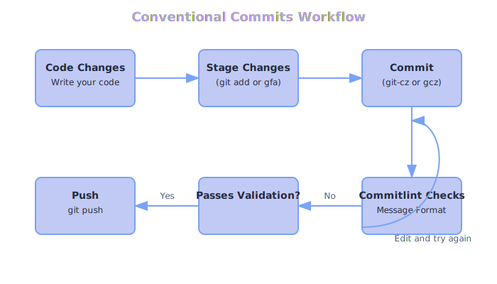
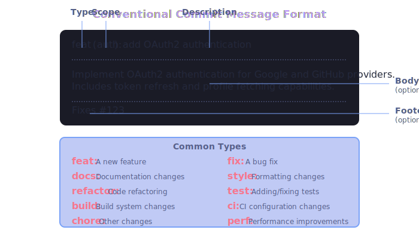

# macOS Dotfiles (2025 Edition)

A comprehensive, modular collection of dotfiles and configuration files for modern macOS development environments, optimized for Apple Silicon with Tokyo Night theme and AI-powered workflows.

## 📚 Table of Contents

- [Features](#features)
- [Prerequisites](#prerequisites)
- [Installation](#installation)
  - [Fresh Installation](#fresh-installation)
  - [Existing Installation](#existing-installation)
  - [Installation Options](#installation-options)
- [Directory Structure](#directory-structure)
- [Tool Configurations](#tool-configurations)
- [AI Integration](#ai-integration)
- [API Utilities](#api-utilities)

## ✨ Features

- 🚀 **One-command installation** for fresh macOS systems 
- 🔄 **Easy updates** for existing installations
- 🛠️ **Comprehensive development tooling** with optimized configurations
- ⌨️ **Modern terminal setup** with Ghostty, ZSH, Starship, and more
- 🖥️ **Efficient window management** with Aerospace and Hammerspoon
- 🎨 **Consistent Tokyo Night theme** across all tools
- 🧠 **AI-powered workflows** with Claude, GPT, and Gemini integration
- 📡 **API development utilities** with OpenAPI tools and client generation
- 🔒 **Secure and maintainable** setup with XDG compliance
- 📊 **TypeScript SDK** for programmatic access to all functionality

## 🔍 Prerequisites

- macOS (Apple Silicon)
- Git
- Curl
- Zsh

## 🚀 Installation

### Fresh Installation

For a fresh macOS installation:

```bash
# Clone the repository
git clone https://github.com/yourusername/dotfiles.git ~/dotfiles

# Run the setup script
cd ~/dotfiles
./scripts/setup.sh
```

This will:

1. Check system requirements
2. Create XDG base directories
3. Symlink configuration files
4. Install Homebrew and packages (optional)
5. Configure macOS preferences (optional)
6. Set up the Git conventional commits workflow
7. Initialize AI integrations and tools

### Existing Installation

For updating an existing installation:

```bash
# Navigate to dotfiles directory
cd ~/dotfiles

# Pull latest changes
git pull

# Run the setup script to update symlinks
./scripts/setup.sh --update
```

### Installation Options

```bash
./scripts/setup.sh [options]

Options:
  --no-brew     Skip Homebrew installation and updates
  --no-macos    Skip macOS preferences configuration
  --minimal     Install only essential configurations
  --update      Update existing installation
  --ai-only     Only update AI-related configurations
  --help        Show this help message
```

## 📁 Directory Structure

```
dotfiles/
├── config/              # Configuration files (XDG_CONFIG_HOME)
│   ├── aerospace/       # Aerospace window manager
│   ├── ai/              # AI tools and integrations
│   │   ├── core/        # Core AI configuration
│   │   ├── prompts/     # Reusable prompt templates
│   │   ├── providers/   # Provider-specific configs
│   │   ├── tools/       # Tool integrations (Git, API, etc.)
│   │   └── utils/       # TypeScript and Bash utilities
│   ├── atuin/           # Shell history
│   ├── bat/             # Cat alternative
│   ├── ghostty/         # Terminal emulator
│   ├── git/             # Git configuration
│   ├── hammerspoon/     # macOS automation
│   ├── nvim/            # Neovim editor
│   ├── starship/        # Shell prompt
│   ├── vscode/          # VS Code editor
│   ├── yazi/            # Terminal file manager
│   ├── zellij/          # Terminal multiplexer
│   └── zsh/             # ZSH configuration
├── docs/                # Documentation
├── home/                # Nix-related
├── modules/             # Nix-related
├── scripts/             # Utility scripts
│   └── setup.sh         # Installation script
├── api/                 # API specifications and clients
│   ├── specs/           # OpenAPI specifications
│   ├── clients/         # Generated API clients
│   └── server/          # API server implementations
├── sdk/                 # TypeScript SDK for dotfiles
├── CLAUDE.md            # Claude Code instructions
├── SPECIFICATIONS.md    # Detailed specifications
└── README.md            # This file
```

## 🔧 Tool Configurations

| Tool | README | Description |
|------|--------|-------------|
| [Aerospace](./config/aerospace/README.md) | [README](./config/aerospace/README.md) | Window manager with Tokyo Night theme |
| [AI Tools](./config/ai/README.md) | [README](./config/ai/README.md) | AI-powered workflows with Claude, GPT, etc. |
| [API Tools](./api/README.md) | [README](./api/README.md) | REST API utilities and OpenAPI tools |
| [Atuin](./config/atuin/README.md) | [README](./config/atuin/README.md) | Shell history with sync and search |
| [Bat](./config/bat/README.md) | [README](./config/bat/README.md) | Cat clone with syntax highlighting |
| [Git](./config/git/README.md) | [README](./config/git/README.md) | Version control with safe defaults |
| [Ghostty](./config/ghostty/README.md) | [README](./config/ghostty/README.md) | Modern GPU-accelerated terminal |
| [Hammerspoon](./config/hammerspoon/README.md) | [README](./config/hammerspoon/README.md) | macOS automation framework |
| [Neovim](./config/nvim/README.md) | [README](./config/nvim/README.md) | Text editor with LazyVim config |
| [Starship](./config/starship/README.md) | [README](./config/starship/README.md) | Cross-shell prompt with Tokyo Night theme |
| [VS Code](./config/vscode/README.md) | [README](./config/vscode/README.md) | Editor with optimized settings |
| [Yazi](./config/yazi/README.md) | [README](./config/yazi/README.md) | Terminal file manager with Neovim integration |
| [Zellij](./config/zellij/README.md) | [README](./config/zellij/README.md) | Terminal multiplexer with layouts |
| [ZSH](./config/zsh/README.md) | [README](./config/zsh/README.md) | Shell with aliases and functions |

## 🤖 AI Integration

This dotfiles repository includes comprehensive AI integration for development workflows, organized in a modular, composable architecture:

```
                          +-------------------------------------+
                          |        AI Configuration System      |
                          +-------------------------------------+
                                           |
                   +--------------------------------------------+
                   |                       |                    |
        +----------v---------+   +---------v--------+   +------v------+
        |  Core Components   |   | Provider Integrations |  |  Interfaces   |
        +--------------------+   +--------------------+   +--------------+
        |                    |   |                    |   |              |
        | +----------------+ |   | +----------------+ |   | +----------+ |
        | |    Config      | |   | |     Claude     | |   | |   CLI    | |
        | +-------+--------+ |   | +-------+--------+ |   | +----+-----+ |
        |         |          |   |         |          |   |      |       |
        | +-------v--------+ |   | +-------v--------+ |   | +----v-----+ |
        | |     Types      | |   | |     OpenAI     | |   | | TypeScript| |
        | +-------+--------+ |   | +-------+--------+ |   | |  Library  | |
        |         |          |   |         |          |   | +----------+ |
        | +-------v--------+ |   | +-------v--------+ |   |              |
        | |     Utils      | |   | |     Anthropic  | |   |              |
        | +----------------+ |   | +----------------+ |   |              |
        +--------------------+   +--------------------+   +--------------+
```

### Key AI Components

- **[Core Configuration](./config/ai/core/)**: Centralized configuration with provider abstraction
- **[Prompts System](./config/ai/prompts/)**: Modular, reusable prompt templates
- **[Provider Support](./config/ai/providers/)**: Implementations for Claude, GPT, Gemini, and local models
- **[Tool Integrations](./config/ai/tools/)**: Git hooks, IDE plugins, and API utilities
- **[TypeScript SDK](./config/ai/utils/typescript/)**: Programmatic access to AI functionality
- **[Bash Utilities](./config/ai/utils/ai_bash.sh)**: Shell integration for AI commands

### Using AI Commands

```bash
# Generate code with AI
just ai:code typescript "Create a function that sorts an array"

# Review code with AI
just ai:review path/to/file.js

# Generate commit messages
just ai:commit-msg

# Create API client from OpenAPI spec
just api:generate-client path/to/spec.yaml output-dir
```

### Git Integration

#### Conventional Commits Workflow

The repository is configured with a comprehensive Conventional Commits workflow for creating structured, standardized commit messages:



```bash
# Stage files with fuzzy selection
gfa

# Create conventional commit with interactive wizard
gcz

# Bypass validation for work-in-progress
gczf
```

#### Commit Message Format



All commits follow the conventional format:
- **Type**: The change category (feat, fix, docs, etc.)
- **Scope**: Optional component affected (auth, api, etc.)
- **Description**: A concise description of the change
- **Body**: Optional longer explanation
- **Footer**: Optional references to issues, breaking changes

#### AI-Assisted Commit Messages

The configuration also includes AI-assisted git commit message generation:

```bash
# Generate a conventional commit message with AI
git ai-commit

# Use AI to analyze code and create a detailed message
just ai commit-msg
```

For detailed information, see:
- [Conventional Commits Guide](./docs/CONVENTIONAL_COMMITS.md)
- [Git Configuration README](./config/git/README.md)
- [AI Tools README](./config/ai/README.md)

## 📡 API Utilities

The `api` namespace provides comprehensive tools for API development:

### OpenAPI Tooling

```bash
# Validate OpenAPI specification
just api:optic:validate spec.yaml

# Start an API proxy for testing
just api:optic:proxy spec.yaml 8080

# Lint OpenAPI specification with Spectral
just api:spectral:lint spec.yaml

# Generate a TypeScript client
just api:generate-client spec.yaml ./clients/typescript

# Generate a Python client
just api:generate-python-client spec.yaml ./clients/python

# Start a mock server based on specification
just api:mock spec.yaml 8080
```

### HTTP Testing

```bash
# Make GET/POST/PUT/DELETE requests
just api:httpie:get https://api.example.com/users
just api:httpie:post https://api.example.com/users name=John age=30

# Save request to Bruno file for API collections
just api:httpie:save-to-bruno https://api.example.com/users GET example ./bruno/
```

For detailed information, see the [API Tools README](./api/README.md).