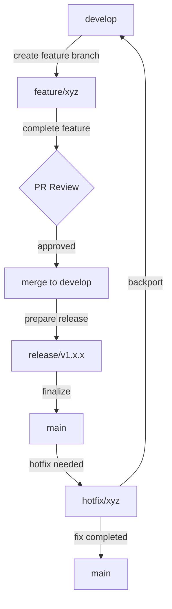

# Git Workflows

Standardized Git workflows and patterns for efficient development.

## Branch Management Strategy

### Branch Types

| Branch Type | Naming Convention | Purpose |
|-------------|-------------------|---------|
| `main` | N/A | Production-ready code |
| `develop` | N/A | Integration branch for features |
| `feature` | `feature/description` | New features or enhancements |
| `bugfix` | `bugfix/issue-id` | Bug fixes |
| `hotfix` | `hotfix/issue-id` | Urgent production fixes |
| `release` | `release/version` | Release preparation |

### Branch Flow



## Commit Practices

### Commit Message Format

```
<type>(<scope>): <subject>

<body>

<footer>
```

### Types

- `feat`: A new feature
- `fix`: A bug fix
- `docs`: Documentation changes
- `style`: Formatting changes
- `refactor`: Refactoring code (no functional changes)
- `test`: Adding/modifying tests
- `chore`: Updating build tasks, package manager configs, etc.

### Example Commit Messages

```
feat(auth): implement JWT authentication

Implement JSON Web Token authentication for API routes.
Add token validation middleware and user session handling.

Closes #123
```

```
fix(api): resolve data race in concurrent requests

When multiple requests hit the endpoint simultaneously,
data corruption could occur due to shared state.
Implemented mutex locks to serialize critical sections.

Fixes #456
```

## Pull Request Workflow

1. **Preparation**
   - Ensure all tests pass locally
   - Rebase on the latest target branch
   - Squash related commits if necessary

2. **Pull Request Creation**
   - Use a clear title following commit message format
   - Include a detailed description
   - Link related issues
   - Add appropriate labels

3. **PR Template**

```markdown
## Description
[Brief description of the changes]

## Related Issues
Closes #[issue-number]

## Type of Change
- [ ] Bug fix
- [ ] New feature
- [ ] Breaking change
- [ ] Documentation update

## Testing
- [ ] Tests added/updated
- [ ] All tests passing

## Screenshots (if applicable)

## Checklist
- [ ] Code follows style guidelines
- [ ] Self-reviewed changes
- [ ] Documentation updated
- [ ] Dependent changes merged
```

4. **Review Process**
   - At least one approval required
   - CI checks must pass
   - No unresolved comments

5. **Merge Strategy**
   - Squash and merge (preferred for feature branches)
   - Rebase and merge (for clean history)
   - Avoid merge commits when possible

## Release Process

1. **Pre-Release Checklist**
   - Create release branch from develop
   - Update version numbers
   - Generate/update changelog
   - Perform final QA

2. **Release Execution**
   - Merge release branch to main
   - Tag version in main
   - Merge back to develop

3. **Post-Release**
   - Publish release notes
   - Deploy to production
   - Monitor for issues

## Git Hooks

### Pre-Commit Hook

```bash
#!/bin/sh
# Run linters and formatters
npm run lint
npm run format

# Run tests
npm test

# Prevent commit if any of the above fail
if [ $? -ne 0 ]; then
  echo "Tests must pass before commit!"
  exit 1
fi
```

### Pre-Push Hook

```bash
#!/bin/sh
# Run full test suite
npm run test:full

# Run type checking
npm run typecheck

# Prevent push if any of the above fail
if [ $? -ne 0 ]; then
  echo "Full tests and type checking must pass before push!"
  exit 1
fi
```

## Advanced Git Techniques

### Interactive Rebase

For cleaning up commit history before sharing:

```bash
git rebase -i HEAD~5  # Rebase last 5 commits
```

Options:
- `pick`: Keep the commit
- `reword`: Change commit message
- `edit`: Amend the commit
- `squash`: Combine with previous commit
- `fixup`: Combine with previous commit, discard message
- `drop`: Remove the commit

### Stashing

Save work in progress without committing:

```bash
git stash save "WIP: description"  # Stash changes
git stash list                     # List stashes
git stash apply stash@{0}          # Apply specific stash
git stash pop                      # Apply and remove latest stash
git stash drop stash@{0}           # Delete specific stash
```

### Git Worktree

Work on multiple branches simultaneously:

```bash
git worktree add ../path-to-new-dir branch-name  # Create new worktree
git worktree list                                # List worktrees
git worktree remove ../path-to-dir               # Remove worktree
```

## Troubleshooting Common Scenarios

### Reverting Changes

```bash
# Revert a specific commit
git revert <commit-hash>

# Revert the last commit but keep the changes staged
git reset --soft HEAD~1

# Completely undo the last commit and discard changes
git reset --hard HEAD~1
```

### Recovering Lost Work

```bash
# Find lost commits
git reflog

# Recover a detached HEAD or deleted branch
git checkout <commit-hash>
git branch recovered-branch
```

### Resolving Merge Conflicts

1. Visual approach:
   ```bash
   git mergetool
   ```

2. Manual approach:
   ```bash
   # After conflict occurs
   # Edit the files to resolve conflicts
   git add <resolved-files>
   git merge --continue
