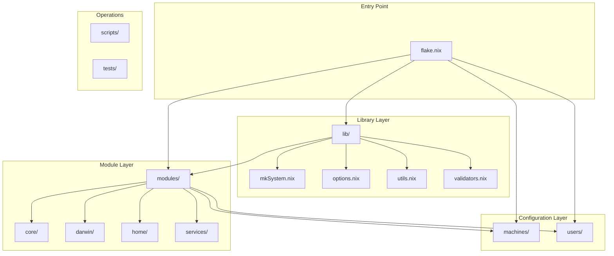
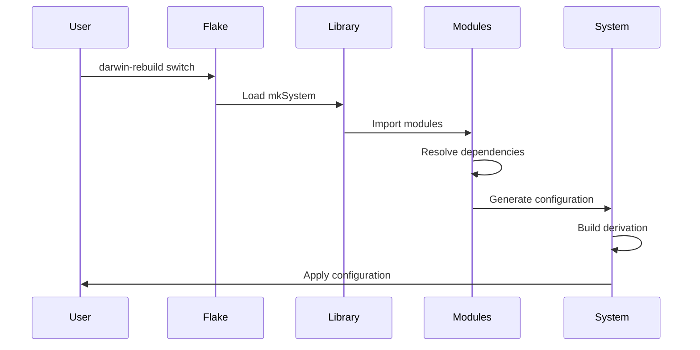
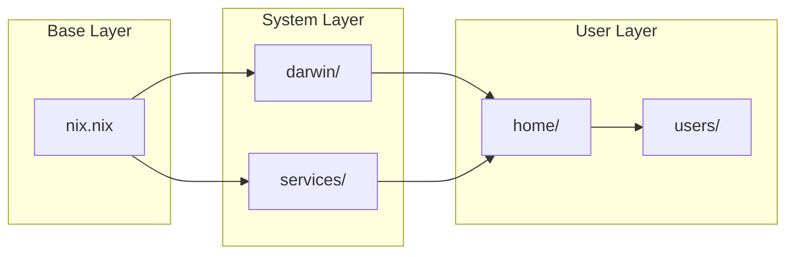

# Nix Darwin Configuration Architecture

## Overview

This document describes the architecture of the modular nix-darwin configuration system, designed for maintainability, extensibility, and clarity.

## High-Level Architecture



## Directory Structure

```
nixdots/
├── flake.nix                 # Entry point and system definitions
├── flake.lock                # Pinned dependencies
│
├── lib/                      # Reusable functions and abstractions
│   ├── default.nix          # Library entry point
│   ├── mkSystem.nix         # System builder functions
│   ├── options.nix          # Option type helpers
│   ├── utils.nix            # Utility functions
│   └── validators.nix       # Validation functions
│
├── modules/                  # Modular system configuration
│   ├── core/                # Core system modules
│   │   └── nix.nix         # Nix daemon and settings
│   │
│   ├── darwin/              # macOS-specific modules
│   │   ├── default.nix     # Darwin module aggregator
│   │   ├── ui/             # UI customizations
│   │   │   ├── dock.nix
│   │   │   └── finder.nix
│   │   ├── system/         # System settings
│   │   │   ├── defaults.nix
│   │   │   ├── keyboard.nix
│   │   │   └── trackpad.nix
│   │   └── apps/           # Application settings
│   │       ├── safari.nix
│   │       ├── terminal.nix
│   │       └── xcode.nix
│   │
│   ├── home/               # Home-manager modules
│   │   ├── default.nix    # Home module aggregator
│   │   ├── shell/         # Shell configurations
│   │   │   ├── zsh.nix
│   │   │   ├── bash.nix
│   │   │   ├── prompts.nix
│   │   │   └── aliases.nix
│   │   ├── tools/         # Development tools
│   │   │   ├── git.nix
│   │   │   ├── tmux.nix
│   │   │   └── development.nix
│   │   └── editors/       # Editor configurations
│   │       └── neovim.nix
│   │
│   └── services/          # System services
│       └── homebrew.nix   # Homebrew integration
│
├── machines/              # Host-specific configurations
│   └── hank-mbp-m4.nix   # Example machine config
│
├── users/                 # User-specific configurations
│   └── hank.nix          # Example user config
│
├── scripts/               # Operational scripts
│   ├── bootstrap.sh      # Initial setup
│   ├── health-check.sh   # System health verification
│   └── recovery.sh       # Disaster recovery
│
├── tests/                 # Test infrastructure
│   ├── lib/              # Test libraries
│   ├── unit/             # Unit tests
│   └── integration/      # Integration tests
│
└── docs/                  # Documentation
    ├── ARCHITECTURE.md   # This file
    └── NIX_FIX.md       # Improvement plan
```

## Module System

### Module Structure

Each module follows a consistent pattern:

```nix
{ config, lib, pkgs, ... }:

with lib;

{
  options.modules.<category>.<name> = {
    enable = mkEnableOption "description";
    # Additional options...
  };

  config = mkIf config.modules.<category>.<name>.enable {
    # Configuration when enabled...
  };
}
```

### Module Categories

1. **Core Modules** (`modules/core/`)
   - System-wide Nix configuration
   - Security settings
   - Network configuration

2. **Darwin Modules** (`modules/darwin/`)
   - macOS-specific settings
   - UI customizations
   - Application preferences

3. **Home Modules** (`modules/home/`)
   - User environment configuration
   - Shell settings
   - Development tools

4. **Service Modules** (`modules/services/`)
   - System services
   - Package managers
   - Background daemons

## Data Flow



## Configuration Composition

### System Building Process

1. **Flake Entry** (`flake.nix`)
   - Defines inputs (nixpkgs, nix-darwin, home-manager)
   - Specifies system configurations
   - Uses library functions to build systems

2. **Library Functions** (`lib/mkSystem.nix`)
   - Abstracts system building logic
   - Handles platform differences
   - Manages module imports

3. **Module Loading**
   - Core modules loaded first
   - Platform-specific modules
   - Service modules
   - User configurations

4. **Configuration Merge**
   - Nix module system merges all configurations
   - Option priorities resolved
   - Final configuration generated

### Example Configuration Flow

```nix
# flake.nix
darwinConfigurations.hostname = 
  mkDarwinSystem {
    system = "aarch64-darwin";
    hostname = "hostname";
    username = "user";
    extraModules = [ ./custom.nix ];
    homeConfig = ./users/user.nix;
  };

# Expands to:
nix-darwin.lib.darwinSystem {
  modules = [
    ./modules/core/nix.nix
    ./modules/darwin
    ./modules/services/homebrew.nix
    ./machines/hostname.nix
    ./custom.nix
    # Plus user and home-manager config
  ];
}
```

## Module Dependencies



## Key Design Principles

### 1. Separation of Concerns
- Each module handles one specific aspect
- Clear boundaries between system and user configuration
- Platform-specific code isolated

### 2. Composability
- Modules can be enabled/disabled independently
- Configuration can be mixed and matched
- Easy to extend with new modules

### 3. Discoverability
- Consistent file naming
- Logical directory structure
- Self-documenting option names

### 4. Testability
- Each module can be evaluated independently
- Integration tests verify complete system
- Validation at multiple levels

## Configuration Options

### Option Hierarchy

```
modules.
├── darwin.
│   ├── dock.enable
│   ├── finder.enable
│   ├── system.enable
│   └── ...
├── home.
│   ├── shell.
│   │   ├── zsh.enable
│   │   └── aliases.enable
│   ├── tools.
│   │   ├── git.enable
│   │   └── tmux.enable
│   └── ...
└── services.
    └── homebrew.enable
```

### Option Types

- **Boolean**: Enable/disable features
- **String**: Names, paths, identifiers
- **Enum**: Predefined choices
- **Submodule**: Nested configuration

## Extension Points

### Adding a New Module

1. Create module file in appropriate category
2. Follow module structure pattern
3. Add to category's `default.nix`
4. Enable in configuration

### Adding a New Machine

1. Create `machines/hostname.nix`
2. Add machine-specific settings
3. Reference in `flake.nix`

### Adding a New User

1. Create `users/username.nix`
2. Import home modules
3. Set user-specific options
4. Reference in machine configuration

## Security Considerations

### Secrets Management
- No secrets in Nix store
- Use `sops-nix` or `agenix` for secrets
- Environment variables for runtime secrets

### Permission Model
- System configuration requires sudo
- User configuration runs as user
- Nix daemon handles builds

## Performance Optimization

### Build Performance
- Minimal module evaluation
- Lazy imports where possible
- Shared nixpkgs instance

### Runtime Performance
- Optimized shell startup
- Lazy loading of completions
- Minimal PATH entries

## Troubleshooting

### Common Issues

1. **Module Not Found**
   - Check import paths
   - Verify file exists
   - Check for typos

2. **Option Conflicts**
   - Use `mkForce` for overrides
   - Check option priorities
   - Review module order

3. **Build Failures**
   - Run with `--show-trace`
   - Check system logs
   - Verify dependencies

### Debug Commands

```bash
# Show configuration
nix eval .#darwinConfigurations.hostname.config

# Check specific option
nix eval .#darwinConfigurations.hostname.config.modules.darwin.dock.enable

# Trace evaluation
nix eval --trace-verbose .#darwinConfigurations.hostname

# Show derivation
nix show-derivation .#darwinConfigurations.hostname.system
```

## Future Enhancements

### Planned Features

1. **Multi-platform Support**
   - Linux (NixOS) configurations
   - WSL2 support
   - Cross-platform modules

2. **Advanced Features**
   - Configuration profiles
   - A/B testing
   - Gradual rollouts

3. **Automation**
   - Auto-update system
   - CI/CD integration
   - Automated testing

### Extension Ideas

- Secret rotation
- Backup automation
- Configuration sync
- Remote deployment

## References

- [Nix Pills](https://nixos.org/guides/nix-pills/)
- [nix-darwin Manual](https://daiderd.com/nix-darwin/manual.html)
- [Home Manager Manual](https://nix-community.github.io/home-manager/)
- [NixOS Module System](https://nixos.org/manual/nixos/stable/#sec-writing-modules)